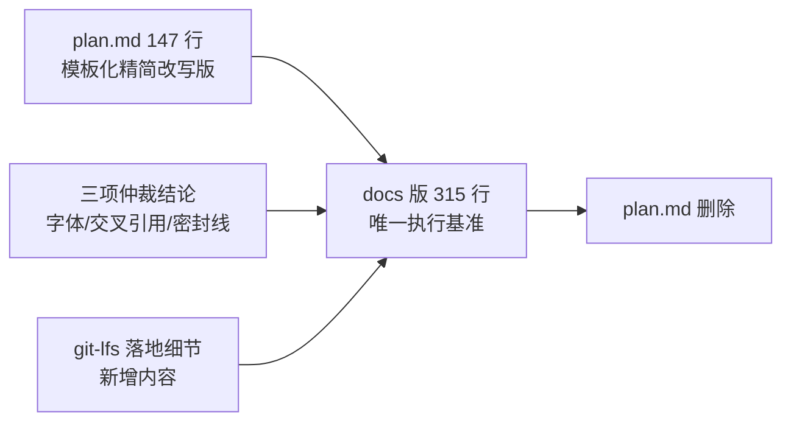
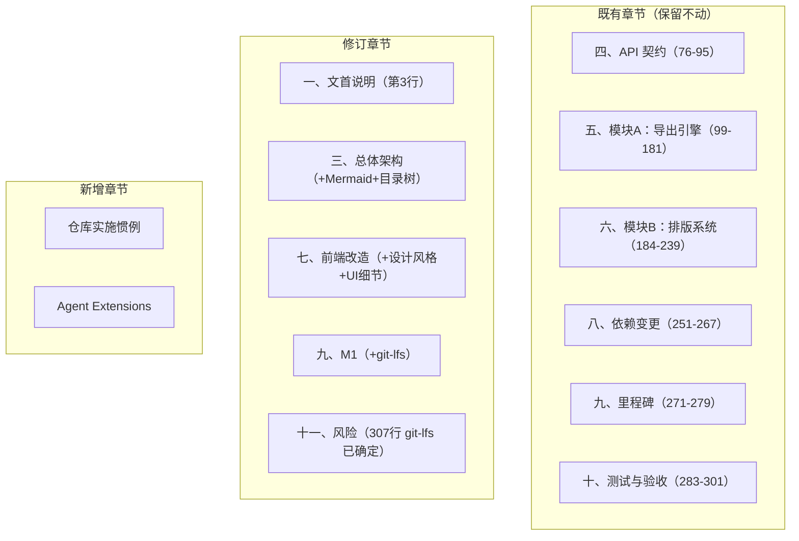

## 产品概述

一次文档治理任务：将根目录 `plan.md` 中独有的内容增量合并进 `docs/导出引擎与排版系统_实施计划.md`，使后者成为仓库内唯一执行基准，合并完成后删除 `plan.md`。合并结果需保留 docs 版全部既有技术深度，同时吸收 plan.md 在编排、UI 细节、仓库实施惯例与协作约定上的增量。

## 核心功能

- **迁移 6 项 plan.md 独有增量**：Agent Extensions 协作约定、设计风格约束、前端组件级 UI 细节、Mermaid 架构图、仓库级目录结构树（含 NEW/MODIFY 标注）、后端实施惯例（路由注册/鉴权/错误/日志/防 N+1）
- **融合而非并列**：迁移内容须并入 docs 版既有章节并去重（架构图并入第三节、UI 细节与设计风格并入第七节「前端改造」），不得追加成重复章节
- **同步修订 3 处既有表述**：文首合并来源说明、M1 里程碑交付内容、字体风险条目（由「可选 git-lfs」改为已确定）
- **补入 git-lfs 落地细节**：`.gitattributes` LFS 规则（须先于首次字体提交）+ 三平台字体校验脚本，拦截 LFS pointer 导致的静默豆腐块
- **收尾**：更新文首定位声明、删除 `plan.md`、全文交叉引用与术语一致性校验

## 技术栈选型

- 文档格式：Markdown（沿用 docs 版既有风格：`##` 章节序号、`###` 小节、**加粗**强调、表格、代码块）
- 架构可视化：Mermaid `flowchart LR`（替换第三节 ASCII 字符画）
- 版本管理：git-lfs（字体二进制，`assets/fonts/**` → lfs filter）
- 校验脚本：PowerShell / Bash / Batch 三平台（对齐 `scripts/` 既有成对惯例）

## 实现方案

**总体策略**：以 docs 版为唯一基准做**定点增量编辑**（`replace_in_file`），严禁整文件重写——docs 版含 OMML 元素映射表（第 133–156 行）、`LayoutSpec` struct（第 188–200 行）、Callout 派生映射（第 106–111 行）等高密度技术内容，整文件重写极易丢失。

**关键决策**：

1. **融合式合并而非追加**。docs 版第七节「前端改造」仅 3 行概述，plan.md 的组件 UI 细节与设计风格约束应**就地扩充该节**；同理 Mermaid 图替换第三节 ASCII 图，目录结构树作为第三节新增子节。避免"两版内容并列重复"的反模式。
2. **命名冲突以 docs 版为准**。plan.md 目录树用 `blocks/figure.rs`，docs 版 §6.2 第 214 行正文用 `blocks/figure_float.rs`。统一为 **`figure_float.rs`**（正文已按此名引用，且 docs 版为基准），迁移目录树时改名并同步注释。
3. **LFS 规则时序不可违**。`.gitattributes` 当前仅 1 行 `*.sql text eol=lf`，无任何 LFS 配置。60MB+ 二进制一旦被普通 `git add` 提交即永久留存在 `.git` 历史中，后续迁移需 `filter-branch`/BFG 重写历史。因此 LFS 规则必须**先于首次字体提交**落地，并在 M1 与风险条目中双处标注该时序警告。
4. **LFS pointer 需主动拦截**。未安装 git-lfs 的克隆者只会拿到 132 字节 pointer 文件（内容以 `version https://git-lfs.github.com/spec/v1` 开头），Typst 加载时静默失败 → 中文豆腐块，比"字体不入库"更难排查。故新增三平台校验脚本，以「文件体积 > 1MB 且不以 LFS pointer 标识开头」为断言。

**性能与可靠性**：纯文本编辑任务，无运行时性能考量。风险控制点为编辑粒度——每次 `replace_in_file` 限定在单一章节内，改后立即读取校验，防止长文档定位漂移导致覆盖错误内容。

## 实施要点

- **编辑粒度**：必须定点替换，禁止整文件重写；每处改动后读取该区段确认未破坏相邻内容（尤其第 133–156 行映射表、第 188–200 行 struct）
- **术语一致性**：迁移内容须与 docs 版既有术语对齐（`ExamBundle` / `LayoutDoc` / `LayoutBlock` / `InlineNode` / `Callout` / `export::pdf` 唯一桥 / `mitex` / `latex2mathml`），不得引入 plan.md 的简称变体
- **行尾格式**：`.gitattributes` 现有规则为 LF，新增 LFS 行须保持 LF 行尾
- **术语与裁决对齐**：三处修订必须与已仲裁结论严格一致——字体入库 + git-lfs、交叉引用暂不产出（无 label 语法）、密封线限定为 PDF 路径能力
- **删除前置条件**：`plan.md` 仅在 6 项增量全部迁移完成且校验通过后删除；两文件在 git 中均为 untracked，删除不可恢复，须最后一步执行

## 架构设计

本次为文档结构重组，目标文件 `docs/导出引擎与排版系统_实施计划.md` 的章节演进：



章节落地映射（合并后 docs 版结构）：



## 目录结构

```
mathset/
├── docs/
│   └── 导出引擎与排版系统_实施计划.md   # [MODIFY] 唯一修改目标（315行）。定点增量：①第3行更新合并来源；②第三节替换 ASCII 图为 Mermaid + 新增带 [NEW]/[MODIFY] 标注的仓库级目录结构树（figure.rs 统一改名为 figure_float.rs）；③第七节扩充设计风格约束（docs/design-system-rules.md + apple-* 类名 + Apple HIG，不做风格翻新）与 ExportDialog.vue / TypesetPreview.vue 组件级 UI 细节（分段控件、模式卡片、PDF 折叠区、debounce 300ms、预检面板、毛玻璃遮罩淡入等）；④新增「仓库实施惯例」小节（handler 位置、protected_routes 注册、AuthUser Extension、(StatusCode, Json) 错误、#[cfg(test)] + tower oneshot、tracing warn 不 dump 大 payload、WHERE id = ANY($1) 防 N+1）；⑤新增「Agent Extensions」章节（code-explorer + codegraph）；⑥第275行 M1 追加 git-lfs 配置与 check_fonts 脚本；⑦第307行风险条目「可选 git-lfs」改为已确定并补充 pointer 拦截说明
├── scripts/
│   ├── check_fonts.ps1            # [NEW] Windows PowerShell 版字体校验。校验 assets/fonts/ 下思源宋体/黑体 SC 四个字重文件存在、体积 >1MB、且内容不以 `version https://git-lfs.github.com/spec/v1` 开头（拦截 LFS pointer），失败时给出「未安装 git-lfs」的明确提示并以非零码退出
│   ├── check_fonts.sh             # [NEW] Linux/macOS Bash 版，同逻辑同退出码
│   └── check_fonts.bat            # [NEW] Windows 批处理入口，转调同目录 .ps1，对齐 clean_visualtest_questions_and_all_papers.{bat,ps1,sh} 既有三平台惯例
├── .gitattributes                 # [MODIFY] 在现有 `*.sql text eol=lf` 之后追加 LFS 规则（保持 LF 行尾），须先于首次字体提交
├── plan.md                        # [DELETE] 6 项增量全部迁移并校验通过后删除；git 中 untracked，删除不可恢复，须最后一步执行
└── assets/
    └── fonts/                     # [NEW-目录] 思源宋体/黑体 SC Regular/Bold 存放位置（本次仅建目录约定与 .gitignore 无需改动，字体二进制由后续里程碑放入；目录当前不存在）
```

## 关键代码结构

`.gitattributes` 新增规则（时序敏感，必须先于首次 `git add assets/fonts/`）：

```gitattributes

# 思源宋体/黑体 SC（约 60MB）—— 必须先于首次字体提交配置，否则需重写历史才能迁出

assets/fonts/** filter=lfs diff=lfs merge=lfs -text

```

字体校验脚本核心断言（三平台共用语义，LFS pointer 为 132 字节且以固定标识开头）：

```

# 遍历 assets/fonts/ 下期望的四个字重（SourceHanSerifSC-Regular / -Bold、SourceHanSansSC-Regular / -Bold）

# 对每个文件断言：①存在 ②体积 > 1MB ③首行不以 "version https://git-lfs.github.com/spec/v1" 开头

# 任一断言失败 → 输出可操作提示（未安装 git-lfs 请执行 `git lfs install && git lfs pull`）并以非零码退出

```

## Agent Extensions

### SubAgent

- **code-explorer**
- 用途：合并前核实待写入 docs 版的「仓库实施惯例」是否属实——`src/lib.rs` 的 `protected_routes` 路由注册方式、`AuthUser` Extension 鉴权、`(StatusCode, Json)` 统一错误返回、handler 目录约定，以及前端 `api/client.ts` 既有封装模式、`Basket.vue` 的 `groupedSections` / `displayNoMap` / `parseOptions` 序列化结构
- 预期结果：产出精确的符号位置与接口签名清单，确保写入 docs 版的实施惯例条目零虚构，实施阶段可直接依据

### MCP

- **codegraph**
- 用途：查询题目模型与 handler 的调用关系，确认新增 `handlers/export.rs` / `handlers/typeset.rs` 的路由注册不会破坏现有结构
- 预期结果：定位准确的影响面，为 docs 版「Agent Extensions」章节提供可验证的协作依据