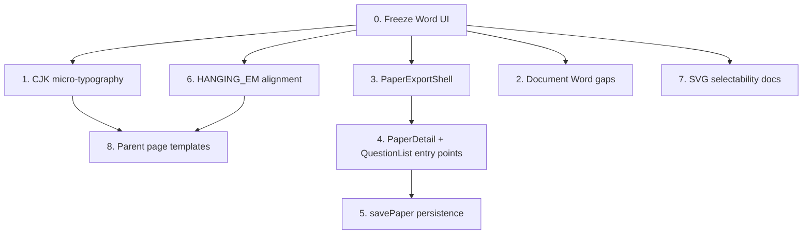

# Export and Typeset System Gap Closure Plan

## 0. Freeze Word Export (UI-only)

Hide the Word option in the front-end export dialog; keep the backend route intact but unmaintained.

**Files:**

- [ExportDialog.vue](frontend/src/components/ExportDialog.vue) ~line 73: Remove `docx` from `FORMATS` array (or filter it out with a feature flag const).
- Optionally add a `const DOCX_ENABLED = false` at the top so re-enabling is a one-line change.

No backend changes. Tests for `export_docx` remain passing but dormant.

---

## 1. CJK Micro-Typography (Typst show rules)

Currently [typst_gen.rs](src/typeset/typst_gen.rs) line 608 sets `lang: "zh", region: "cn"` and `justify: true` but has **no** explicit CJK punctuation or spacing rules.

### 1.1 Punctuation hanging and compression

Add to the `prologue()` method (after `#set par`):

```typst
#set text(cjk-latin-spacing: auto)
#show: set text(hanging-punctuation: true)
```

Typst 0.15 supports `cjk-latin-spacing` on `text` (auto = insert thin space between CJK and Latin) and basic hanging punctuation. Verify with a test case containing trailing commas and leading quotes.

### 1.2 Pangu spacing (CJK-Latin 0.25em)

`cjk-latin-spacing: auto` is Typst's built-in pangu equivalent. Currently it is **not set** (defaults to `none`). Adding it explicitly ensures the 0.25em gap between CJK and inline Latin/math.

### 1.3 Baseline alignment for inline math

Typst's default inline math baseline is generally correct. Add a snapshot test with mixed CJK + `$x^2$` to anchor the current behavior and catch regressions.

**Files to change:**

- [src/typeset/typst_gen.rs](src/typeset/typst_gen.rs): `prologue()` method (~line 608-619)
- Add snapshot tests in the same file's `#[cfg(test)]` block

---

## 2. Format Parity: Word Gaps (Deferred Documentation)

Word currently lacks: sealed binding line, dynamic header, blank styles (lines/dots), K100, figure float. Since Word is frozen (item 0), these are **not actionable now**.

Create a tracking section in [docs/导出与排版系统.md](docs/导出与排版系统.md) under "Known Limitations" with each gap labeled as `FROZEN: requires Word unfreeze`. This prevents the gaps from being forgotten when Word is re-enabled.

---

## 3. Unified Front-End Rendering (PaperDocument extraction)

### Problem

`Basket.vue` and `PaperDetail.vue` each contain duplicated question rendering logic (option parsing, stem display, section grouping) and both maintain their own `apple-paper` CSS layout. Meanwhile the *real* typeset output is only shown inside `TypesetPreview.vue` (SVG from Typst).

### Approach

Do **not** build a third rendering path. Instead, make the Typst SVG preview the canonical "paper view" in both pages, and reduce the `apple-paper` HTML to a lightweight selection/management shell.

### 3.1 Extract `PaperExportShell.vue` component

A thin wrapper that:

- Accepts `sections: ExamSectionRequest[]` and metadata props
- Hosts `ExportDialog` + `TypesetPreview` (full preview mode)
- Emits `print` (fallback) and `export-done` events

### 3.2 Integrate into `PaperDetail.vue`

- Import `PaperExportShell`
- Serialize `paper.questions` into `ExamSectionRequest[]` (reuse `Basket.vue`'s `sectionsPayload` pattern)
- Replace `downloadPaper()` / `window.print()` with `openExport()` opening the shell
- Keep the existing HTML card view for browsing/selecting questions

### 3.3 Keep `Basket.vue` as-is internally

It already uses `ExportDialog`. The only change: mount `TypesetPreview` in an always-visible split pane (or toggle) so the teacher sees the Typst output alongside their selection, not just inside the export modal.

**Files:**

- New: `frontend/src/components/PaperExportShell.vue`
- Modify: [frontend/src/views/PaperDetail.vue](frontend/src/views/PaperDetail.vue)
- Modify: [frontend/src/views/Basket.vue](frontend/src/views/Basket.vue) (optional split-pane preview)

---

## 4. Entry Points: PaperDetail and QuestionList

### 4.1 PaperDetail full export

`PaperDetail.vue` currently calls `window.print()` at line 319. Replace with:

1. Add `showExport` ref + `ExportDialog` mount (same pattern as Basket)
2. Serialize `groupedSections` into `ExamSectionRequest[]`
3. Wire the "download" buttons (~line 416, 602) to `openExport()`
4. Include `TypesetPreview` (full preview per user request)

### 4.2 QuestionList paper download

[QuestionList.vue](frontend/src/views/QuestionList.vue) has a `downloadPaper(p: PaperSummary)` at line 945 that currently shows a toast. Options:

- Navigate to `/papers/:id` (which will now have full export)
- Or open `ExportDialog` inline with a fetch of paper questions

Recommend: navigate to PaperDetail (simpler, reuses item 4.1).

**Files:**

- [frontend/src/views/PaperDetail.vue](frontend/src/views/PaperDetail.vue)
- [frontend/src/views/QuestionList.vue](frontend/src/views/QuestionList.vue)

---

## 5. Paper Persistence (savePaper)

### 5.1 Backend API already exists

[src/handlers/papers.rs](src/handlers/papers.rs) line 299: `create_paper` (`POST /papers`) and line 485: `add_questions` (`POST /papers/:id/questions`).

### 5.2 Frontend `paperApi` needs create/addQuestions

Add to [frontend/src/api/client.ts](frontend/src/api/client.ts) `paperApi`:

```ts
create(data: CreatePaperPayload) {
  return client.post<PaperDetail>('/papers', data)
},
addQuestions(paperId: string, questions: AddQuestionPayload[]) {
  return client.post(`/papers/${paperId}/questions`, { questions })
},
```

### 5.3 Wire `savePaper()` in Basket.vue

[Basket.vue](frontend/src/views/Basket.vue) line 371: replace the toast placeholder with:

1. Prompt for title (reuse the export dialog's title input pattern or a simple `AppModal`)
2. Call `paperApi.create({ title, ... })` then `paperApi.addQuestions(id, sectionQuestions)`
3. Navigate to `/papers/:id` on success
4. Optionally store the layout config in paper metadata JSONB

**Files:**

- [frontend/src/api/client.ts](frontend/src/api/client.ts)
- [frontend/src/views/Basket.vue](frontend/src/views/Basket.vue)

---

## 6. Hanging-EM Alignment

### Problem

[src/export/pdf.rs](src/export/pdf.rs) line 52: `HANGING_EM = 2.0` used for choice grid available-width calculation.
[src/typeset/typst_gen.rs](src/typeset/typst_gen.rs) line 507: `HANG_EM = 2.6` used for actual Typst rendering indent.

The 0.6em gap means the grid decision is made with a wider available width than reality, potentially selecting too many columns. The `measure()` fallback (R7) catches this at runtime but costs 20-30ms per question.

### Fix

Move the constant to a single source of truth in [src/typeset/spec.rs](src/typeset/spec.rs) or [src/typeset/blocks/choice_grid.rs](src/typeset/blocks/choice_grid.rs):

```rust
pub const QUESTION_INDENT_EM: f64 = 2.6;
```

Update both `pdf.rs` line 137 and `typst_gen.rs` line 507 to reference it. This eliminates the R7 measure fallback for most questions, improving mixed-question compile times.

**Files:**

- [src/typeset/blocks/choice_grid.rs](src/typeset/blocks/choice_grid.rs) (add const)
- [src/export/pdf.rs](src/export/pdf.rs) (use shared const)
- [src/typeset/typst_gen.rs](src/typeset/typst_gen.rs) (use shared const)

---

## 7. SVG Text Selectability

### Problem

Typst compiles SVG with outlined glyphs (`<path>` instead of `<text>`), making text non-selectable in preview.

### Options

- **A) Accept as-is**: Preview is for visual verification, not text copying. Document this as a known limitation. (Recommended for now -- Typst does not support `<text>` SVG output.)
- **B) PDF.js preview**: Render the PDF in an iframe/canvas with pdf.js for selectable text. Adds complexity and the project already has `pdfjs-dist` as a dependency.

### Recommendation

Keep current SVG approach. Add a "Copy question text" button in the preview toolbar that copies from the source data (not the SVG). Document the limitation in [docs/导出与排版系统.md](docs/导出与排版系统.md).

**Files:**

- [frontend/src/components/TypesetPreview.vue](frontend/src/components/TypesetPreview.vue) (optional copy button)
- [docs/导出与排版系统.md](docs/导出与排版系统.md)

---

## 8. Data-Driven Parent Page Templates

### Problem

First-page cover, body-page layout, and answer-key layout are hardcoded in `typst_gen.rs` `prologue()` and `cover()` methods. Adding a new template variant requires editing Rust code.

### Approach: LayoutSpec extension + template registry

### 8.1 Extend `LayoutSpec` with parent-page config

Add to [src/typeset/spec.rs](src/typeset/spec.rs):

```rust
#[derive(Debug, Clone, PartialEq, Serialize, Deserialize, TS)]
pub struct ParentPageConfig {
    /// First page: show cover header, score summary table, exam instructions
    pub cover: CoverConfig,
    /// Body pages template
    pub body: BodyConfig,
}

#[derive(Debug, Clone, PartialEq, Serialize, Deserialize, TS)]
pub struct CoverConfig {
    pub show_title: bool,
    pub show_score_table: bool,
    pub show_instructions: bool,
    pub show_student_info: bool,
    // Future: custom logo, watermark, etc.
}

#[derive(Debug, Clone, PartialEq, Serialize, Deserialize, TS)]
pub struct BodyConfig {
    pub show_header: bool,
    pub show_footer: bool,
    // Future: watermark, section dividers, etc.
}
```

### 8.2 Refactor `typst_gen.rs` cover/prologue

Extract the current hardcoded cover generation into methods that read `ParentPageConfig`:

- `cover()` checks `config.cover.show_title`, `show_score_table`, etc.
- `prologue()` checks `config.body.show_header/show_footer`
- Default `ParentPageConfig` matches current behavior exactly (backward compatible)

### 8.3 Expose in profiles

Each `ProfilePreset` in `spec.rs` gets a `parent_pages` field, so the four built-in presets can have different cover/body configurations. The `ExportDialog` can optionally expose cover toggles.

**Files:**

- [src/typeset/spec.rs](src/typeset/spec.rs)
- [src/typeset/typst_gen.rs](src/typeset/typst_gen.rs)
- [frontend/src/api/types/layout.ts](frontend/src/api/types/layout.ts) (auto-generated by ts-rs)
- [frontend/src/components/ExportDialog.vue](frontend/src/components/ExportDialog.vue) (optional cover toggles)

---

## Execution Order




Items 0, 1, 6 can start in parallel. Item 3 unblocks 4 and 5. Items 2 and 7 are documentation-only.