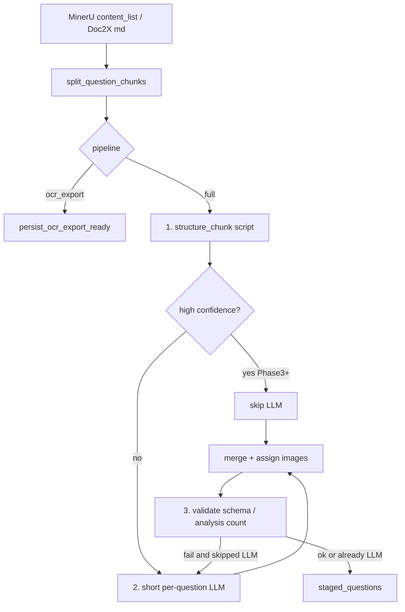

# Full-auto script-first structuring

> Execute tomorrow **phase by phase**. Each phase is independently testable and shippable. Do not introduce a third ingest mode.

**Goal:** After MinerU/Doc2X OCR, 全自动 produces importable `ParsedQuestion`s with: (1) script cut of stem/options/images/methods, (2) LLM only when the script is unsure, (3) hard checks so Doubao-style dropped 法二 and leftover options cannot silently pass.

**Architecture:** Keep `[split_question_chunks](src/ai/layout/split.rs)` as the cut-question step. Add a new `src/ai/structure/` crate module that turns each markdown **chunk** into a `ScriptDraft`. Wire it only into the PDF fast path in `[run_pdf_fast_path](src/workers/ai_parse_worker.rs)` after the existing `is_ocr_export` early return. `ocr_export` still stops at `persist_ocr_export_ready`. Import JSON still uses `[import_questions](src/handlers/ai_tasks.rs)` + cleaner only.

**Non-goals (lock these):**

- No new `pipeline` value; UI stays 全自动 / 站外结构化.
- Do not run Stage2 or this structurer on `ocr_export`.
- Do not weaken import-path `fix_invalid_escapes` / `normalize_llm_latex`.
- Do not rewrite page-image `ocr_page_to_json` in Phases 1–4 (whole-page LLM stays until a later optional phase).
- Do not put new logic into the already ~4k-line worker file beyond a thin call site.




---

## Current vs target (full only)

Today, after OCR (`[run_pdf_fast_path` ~2000–2050](src/workers/ai_parse_worker.rs)):

- `split_stage2_with_layout` → every chunk → `parse_stage2_chunk` (full/slim prompt) → `post_process_batch` → `draft_question_from_chunk` on failure.

Target:

1. Same split (already handles MinerU layout vs markdown fallback).
2. `structure_chunk(&str) -> ScriptDraft` (new).
3. High confidence → skip LLM (Phase 3+). Low → short prompt, **one question**, optional script JSON as hint.
4. Merge + validate; keep `draft_question_from_chunk` as last resort.
5. Existing `assign_chunk_images` still runs.

`ocr_export` path at `[is_ocr_export` ~1977](src/workers/ai_parse_worker.rs) must remain an immediate return. Do not call `structure_chunk` there.

---

## File map

- **Create** `[src/ai/structure/mod.rs](src/ai/structure/mod.rs)` — public API: `structure_chunk`, `ScriptDraft`, `Confidence`.
- **Create** `[src/ai/structure/options.rs](src/ai/structure/options.rs)` — A–D (and A–C/E) cut from stem.
- **Create** `[src/ai/structure/analysis.rs](src/ai/structure/analysis.rs)` — 法一/解法二/另解 heading split; heading count.
- **Create** `[src/ai/structure/confidence.rs](src/ai/structure/confidence.rs)` — conservative gate.
- **Create** `[src/ai/structure/validate.rs](src/ai/structure/validate.rs)` — post-merge checks.
- **Create** `[src/ai/structure/merge.rs](src/ai/structure/merge.rs)` — script vs LLM merge (Phase 2).
- **Modify** `[src/ai/mod.rs](src/ai/mod.rs)` — `pub mod structure;`.
- **Modify** `[src/ai/prompt.rs](src/ai/prompt.rs)` — add `STAGE2_PATCH_PROMPT` in Phase 3 (do not change `docs/rules-prompts.md`; that file is for 站外).
- **Modify** `[src/workers/ai_parse_worker.rs](src/workers/ai_parse_worker.rs)` — PDF fast-path loop only; optional `progress.phase`.
- **Modify** `[src/handlers/ai.rs](src/handlers/ai.rs)` — extract `finalize_parsed_questions` from the per-item loop of `post_process_batch` so script drafts share sanitize / option-residue strip / KP match without faking LLM JSON.
- **Optional Phase 4 UI:** `[frontend/src/composables/useAiParsePolling.ts](frontend/src/composables/useAiParsePolling.ts)`, `[TaskProgressPanel.vue](frontend/src/views/edit/components/TaskProgressPanel.vue)` — show `structuring` / `stage2` if backend writes `progress.phase`.

---

## Core types (implement in Phase 1)

```rust
pub struct ScriptDraft {
    pub question: ParsedQuestion,  // stem/options/analysis/question_no/type filled
    pub confidence: Confidence,
    pub reasons: Vec<String>,      // why high/low; also copied into warnings
    pub method_heading_count: usize,
    pub image_urls_in_chunk: Vec<String>,
}

pub enum Confidence { High, Low }
```

`structure_chunk` must be **pure** (no DB, no HTTP) so unit tests do not need Postgres.

---

## Conservative high-confidence bar (do not loosen)

All must hold, otherwise `Low` (LLM required):

- Exactly **one** question-start in the chunk (reuse `question_start_regex` / layout helper; ignore `(1)(2)` and `3.14`).
- Every `` in the chunk appears in stem ∪ options ∪ analysis.
- **Choice:** consecutive labels **A–D** (exactly 4). 3 or 5 options → Low. Stem must not still contain `A.`/`A、` residue after cut.
- **Fill/solution:** no A–D option list at line starts; `(1)(2)` stay in stem.
- **Methods:** `count_method_headings(chunk) == analysis.len()`. If count is 0:
  - exam paper (not 解析卷) with empty analysis → allowed High for choice-only papers;
  - `looks_like_analysis_paper` **never High** without explicit 法一/法二/另解 headings (unstructured 解析 blob).
- Chunk is not the 6000-char markdown dump fallback (`split_via == "markdown_fallback"` and a single huge blob) → always Low.

False High is worse than an extra LLM call.

---

## Merge rules (Phase 2)

When both script draft and LLM `Vec<ParsedQuestion>` exist (typically one question per chunk):

- Take LLM stem/options/answer if they pass validate; else keep script.
- If `script.method_heading_count > llm.analysis.len()`, **restore script `analysis`** (this is the code-side fix for Doubao dropping 法二+).
- Always `assign_chunk_images(chunk, &mut qs)` after merge.
- Union `warnings`; add `"规则结构化"` / `"模型补全"` for audit.

---

## Phase plan (ship in this order)

### Phase 1 — Script structurer + tests (no skip-LLM yet)

**Deliverable:** `structure_chunk` works on markdown fixtures. Worker still calls LLM for every chunk. Optionally log draft confidence (tracing only).

**Extractors:**

Options — line-start patterns: `A.` `A、` `A．` `A)` `(A)` then B/C/D. Cut stem at first A. Reuse the same idea as `[OPTIONS_RESIDUE_RE](src/handlers/ai.rs)` (lines 105–110) but **extract** into `ParsedOption { label, content }`, do not only strip.

Methods — split on headings (line-start or after `【解析】`):

- `解法一/二/三…` `方法 1/2` `法一/法二` `另解` `别解`
- Keep title from source; content is text until next heading or next question-start.
- If there is `【解析】` / `【分析】` but no 法N, one analysis item titled `解析` (confidence Low).

Also: `question_no` from first question-start; `guess_chunk_question_type` logic can move here; collect `image_urls`; call `sanitize_question_markup` on stem/options/analysis so `$`/`\(` normalize early.

**Tests** in `src/ai/structure/` (table-driven markdown, no LLM):

- Choice: stem `"下列结论正确的是"` + A–D; options filled; stem has no `A.`.
- Choice with figure: `` stays in stem, listed in `image_urls`.
- Analysis paper: 法一 + 法二 + 另解 → `analysis.len()==3`, none truncated.
- `(1)(2)` stay in stem, not in analysis.
- Instruction line `1.答卷前` is not a question (already covered by split; structurer must not invent a second question).
- 解析卷 blob without 法N → Low.
- Two question-starts in one chunk → Low, do not merge into one stem.

**Worker:** no behavior change except optional `tracing::info!(confidence, method_heading_count)`.

**Verify:** `cargo test --lib structure` (and existing layout/cleaner tests still pass).

---

### Phase 2 — Validate + merge after LLM (still always LLM)

**Deliverable:** LLM output cannot silently drop methods or leave A–D in stem. Script is the safety net.

`**validate.rs`:**

- Schema: `question_type` in `choice|fill|solution|multiple`; stem non-empty; choice has 4 options if High (Low may be incomplete).
- `method_heading_count` vs `analysis.len()` — mismatch → warning + treat as Low for Phase 3 gate.
- Options residue: call existing `strip_options_residue_from_stem` via extracted `finalize_parsed_questions`.
- LaTeX: existing `sanitize_question_markup` / `normalize_llm_latex` (do not duplicate escape logic).

`**merge.rs`:** implement merge rules above.

**Worker change** in `parse_stage2_chunk` (or a new wrapper `structure_then_stage2`):

1. `let draft = structure_chunk(chunk);`
2. Existing LLM + `post_process_batch`.
3. `merge_script_and_llm(chunk, draft, llm_qs)`.
4. `validate_structured`; on analysis-count fail, restore script analysis if fuller.
5. Existing draft fallback if LLM fatally fails — if script has options/methods, **prefer script question over empty OCR blob** (better than today’s `options: None` draft).

**Do not skip LLM yet.**

**Tests:** merge fixture where LLM JSON has one analysis item but source has 法一/法二 → result has 2. Choice LLM left A–D in stem → residue stripped.

**Verify:** `cargo test --lib structure` plus worker tests `test_draft_from_chunk_`* still pass; add one merge test.

---

### Phase 3 — Skip LLM on High + short patch prompt on Low

**Deliverable:** High-confidence choice/simple items cost 0 tokens. Low items get a **short** prompt, one question per call.

**Worker loop** (`[run_pdf_fast_path` batch](src/workers/ai_parse_worker.rs) ~2029–2053):

- For each chunk: structure → if `High`, `finalize_parsed_questions` + assign images, skip provider.
- If `Low`, call LLM with `STAGE2_PATCH_PROMPT` (new, **not** the full `CORE_PARSE_RULES` dump):
  - Input: this chunk’s markdown + optional script JSON.
  - Output: bare `{ "questions": [ one item ] }`.
  - Rules: do not drop analysis items; do not invent answers; `$...$` only; keep ``.
- Analysis papers: keep using slim extra line (“几种解法几项”) inside the patch prompt; still never High without 法N headings.
- Retain 2-attempt retry / fatal-error / cancel behavior from `parse_stage2_chunk`.
- If skip-LLM then validate fails → **fall back to LLM** (do not ship the bad High draft).

**Do not edit** `[docs/rules-prompts.md](docs/rules-prompts.md)` (站外 copy source). In-app patch prompt lives only in `prompt.rs`.

**Tests:**

- High draft never needs a provider (unit-test the gate function with a mock: `should_call_llm(&draft) == false`).
- Low 解析卷 `should_call_llm == true`.
- Validate-fail High is forced to LLM (unit-test the branch, not live API).

**Verify:** existing `test_split_stage2_`* unchanged; new gate tests; `cargo test --lib`.

---

### Phase 4 — Progress, regression, ship checklist

**Backend:** write `progress.phase` = `structuring` | `stage2` | `ocr` (OCR already implied). Counts: `processed_count` still per staged question. Log `split_via`, `high_skip_n`, `llm_n`.

**Frontend (small):** if `phase === 'structuring'` show “正在规则切题…”; `stage2` keep “AI 正在解析…”. No new radio. `[useAiParsePolling.ts](frontend/src/composables/useAiParsePolling.ts)` already branches on `ocr_export`.

**Regression (must pass before calling Phase 3 done in production):**

- Submit `pipeline=ocr_export` → still `phase=ocr_ready`, **zero** Stage2 / structure-skip side effects, import-questions still works.
- `pipeline=full` PDF path uses structure+gate.
- Import JSON with `\(` / `\triangle` still repaired (existing `ai_tasks` tests).

**Manual (when executing):** one 高考选择题 PDF, one 解析卷 with 法一/法二; confirm 全自动 preview; confirm 站外 OCR tab + paste JSON.

---

### Phase 5 — Optional later (not tomorrow unless Phases 1–4 are done)

Unify **page fallback** `[ocr_page_to_json](src/workers/ai_parse_worker.rs)`: concatenate page OCR → layout split → same `structure_then_stage2`, instead of whole-page LLM. Out of scope for the first four phases so 全自动 PDF (MinerU/Doc2X) lands first.

---

## Implementation notes for the executor

- **TDD per phase:** write failing tests in `src/ai/structure/*.rs` `#[cfg(test)]` first, then implementation. Run `cargo test --lib structure -- --nocapture`.
- **Do not** expand `ai_parse_worker.rs` with regexes; import `crate::ai::structure`.
- **Reuse** `question_start_regex` / `is_instruction_numbered_line` from `[src/ai/layout/mod.rs](src/ai/layout/mod.rs)` rather than copying the worker’s duplicate regexes if possible; if worker helpers are `fn` private, export from `layout` and delete duplicates in a later cleanup (not required in Phase 1).
- `**finalize_parsed_questions`:** move the per-question body of `[post_process_batch](src/handlers/ai.rs)` (sanitize, strip options, empty analysis dummy, KP match) into `pub(crate) async fn finalize_parsed_questions(qs: Vec<ParsedQuestion>, pool: &PgPool)`. `post_process_batch` stays the JSON entry for LLM and import. Script High path calls finalize directly.
- **Commits:** one conventional commit per phase, e.g. `feat(ai): script-structure chunks before Stage2`, `feat(ai): merge script analysis when LLM drops methods`, `feat(ai): skip Stage2 on high-confidence chunks`, `feat(ai): full-auto progress phase for structuring`.
- **Feature flag (optional):** `MATHSET_ALWAYS_STAGE2=1` env to force LLM while tuning the gate in production. Default off after Phase 3 tests pass.

---

## Spec coverage


| Requirement                             | Phase                                   |
| --------------------------------------- | --------------------------------------- |
| Script: 切题 already exists; 抽图/选项/解法     | 1                                       |
| LLM only on low-confidence              | 3                                       |
| Schema / escape / analysis-count checks | 2 (+ existing cleaner)                  |
| 站外流程不变                                  | 4 regression + never touch early return |
| Conservative gate / 解析卷                 | 1 confidence + 3                        |
| Prefer script over empty draft          | 2                                       |
| Validate-fail High → LLM                | 3                                       |
| No third ingest mode                    | all                                     |


