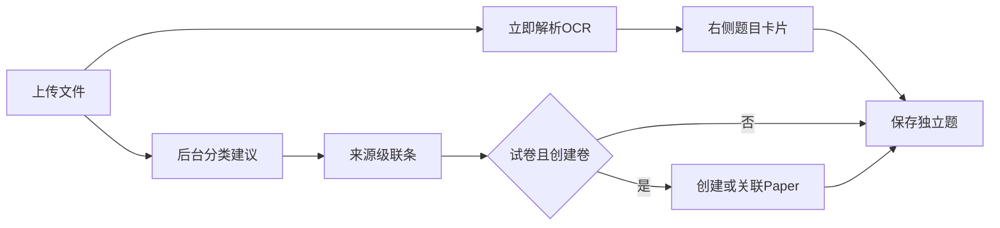

# OCR 先行 + 三级来源级联

## 产品约定

- 上传 PDF/图片后**立刻解析**，左侧保持原文，右侧出卡片。来源条不阻塞识别。
- 来源两级：**大类 → 子类**。大类为试卷时展开卷信息，并提供「同时创建试卷」开关。
- 不创建试卷、以及练习/其他：题目**只作为独立题**，不自动建 Paper，也不建默认 Collection。
- 「其他」子类含：专题资料、教辅练习、教材例题、讲义、错题。

级联字典：

- 试卷：月测、单元测、阶段测、期中、期末、高考真题、模拟题
- 练习：课前预习、课堂例题、随堂练习、课后作业、单元复习
- 其他：专题资料、教辅练习、教材例题、讲义、错题

模拟题才显示子来源（一模 / 二模）。创建试卷且未关联已有卷时，名称必填；其余卷字段选填。

## 新流程

当前闸门在 [`src/handlers/ai_tasks.rs`](src/handlers/ai_tasks.rs)（`doc_status != "confirmed"` 拒绝建任务）和 [`src/workers/ai_parse_worker.rs`](src/workers/ai_parse_worker.rs) Stage 1 同样检查。前端 [`AiRecognizeDialog.vue`](frontend/src/views/edit/components/AiRecognizeDialog.vue) 在 `onConfirmDoc` 成功后才 `startTask`。这三处都要解开。

## 数据模型

在 [`src/models/document.rs`](src/models/document.rs) 用新白名单替换扁平 16 类（TEXT + 后端校验，不做 PG enum）：

- `source_category`: `paper` | `practice` | `other`
- `source_kind`: 上表子类英文 slug（如 `monthly_test`、`gaokao`、`mock`、`in_class`、`workbook`、`textbook_example`、`lecture`、`wrong_question`）
- `create_paper`: bool，仅 `paper` 有效
- 现有 `document_type` **保留一列做兼容**：写入时同步为 `category:kind` 或映射旧值，避免老筛选直接崩

`ConfirmDocumentRequest` 增加 `source_category`、`source_kind`、`create_paper`。`is_paper_type` 改为「大类是试卷 **且** create_paper」。`mixed` / `unknown` 不再作为用户可选类型；分类失败默认 `practice` + `in_class`。

旧 16 类一次性映射（写入计划注释 + 查询兼容）：

- `exam` / `mock_exam` → paper（子类按原类型：正式卷默认期末/月测需保守映射为 `monthly_test` 或保留旧值直到用户改；`mock_exam` → `mock`）
- 练习五类对到新练习子类；`unit_exercise` → 练习/单元复习；`chapter_exercise` → 其他/专题
- `textbook_example` / `teaching_material` / `wrong_question` / `exercise_book` / `special_training` → 其他对应子类

题目侧：保存时把 `source_category`、`source_kind`、试卷快照（年/校/地区等）写入 `questions.metadata`。列表筛选改为读题目 metadata，而不是只 JOIN `documents.document_type`（独立题没有 Paper/Collection，旧 JOIN 会筛丢）。

## 后端改动

1. **允许未确认就解析**：[`submit_parse_task`](src/handlers/ai_tasks.rs) 接受 `uploaded` / `classifying` / `classified` / `confirmed`。Worker 去掉「必须 confirmed」；Stage 2 **默认不建容器**。仅当 document 快照 `create_paper=true` 时走现有 [`create_paper_from_meta`](src/workers/ai_parse_worker.rs)。练习/其他不 `get_or_create_collection`。
2. **confirm 可后置**：[`confirm_document`](src/handlers/documents.rs) 识别进行中也可调用；更新来源字段。`create_paper=true` 且尚无 paper 时再创建（或关联 `paper_id`）。
3. **分类 Prompt**：[`src/ai/prompt.rs`](src/ai/prompt.rs) 输出 `{ source_category, source_kind, title, confidence, reason }`；低置信默认练习/随堂练习，不再逼停在 unknown。
4. **列表查询**：[`src/handlers/questions.rs`](src/handlers/questions.rs) 的 `document_type` 过滤改为 metadata 的 category/kind（并兼容旧 `documents.document_type`）。
5. 单测：`validate_confirm`、未确认可建任务、`create_paper=false` 不插 `papers`。

## 前端改动

1. [`AiRecognizeDialog.vue`](frontend/src/views/edit/components/AiRecognizeDialog.vue)：`uploadAndClassify` 后**立即** `startTask`（PDF 仍 `pdf_direct`）。classify 并行，结果只预填来源条。`docFlowState === 'confirm'` 不再挡住解析。
2. 重写 [`DocumentTypeConfirmStep.vue`](frontend/src/views/edit/components/DocumentTypeConfirmStep.vue) 为预览区顶部/侧栏的**来源级联条**（或拆成 `SourceCascadeBar.vue`）：
   - 三个大类 + 子类 chips
   - 试卷：卷信息表单 + 「同时创建试卷」+ 可选关联已有卷
   - 模拟题才显示一模/二模
   - 变更 debounce 调用 confirm/PATCH，不打断 OCR
3. 去掉 16 宫格和「确认后才能开始识别」。进度仍在左侧原文之上的细条，不替换 PDF。
4. [`QuestionEdit.vue`](frontend/src/views/QuestionEdit.vue) 保存/全部保存：`create_paper` 为真则带 `paper_ids`；否则 `paper_ids: []`。来源写入 metadata。
5. [`QuestionList.vue`](frontend/src/views/QuestionList.vue) + [`client.ts`](frontend/src/api/client.ts)：筛选改为大类/子类级联；类型与标签常量化到一处（如 `frontend/src/utils/questionSource.ts`），避免三处字典漂移。
6. [`CollectionDetail.vue`](frontend/src/views/CollectionDetail.vue) 等展示处用新标签，旧值走映射函数。

## 明确不做

- 不恢复「混合资料」多集合壳编辑器。
- 不为练习/其他自动建 Collection。
- 不把卷字段做成全部必填。
- 不在本次改题库信息架构之外的试卷编辑页大重构。
