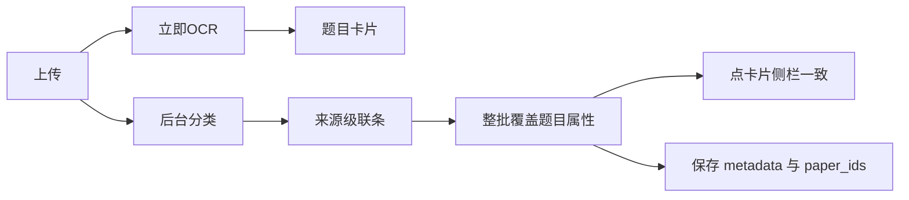

# OCR 先行 + 来源级联 + 试卷属性同步（合并计划）

## 目标

上传 PDF/图片后立刻 OCR；来源用「试卷 / 练习 / 其他」两级级联，不阻塞识别。填完试卷信息后，**本批识别题**的学段、学科、年级、学期、年份、省份、市区、来源、试卷关联与来源条一致（编辑页侧栏可见，保存落库一致）。不建卷 / 练习 / 其他均为独立题。

## 当前落地状态

**已完成（勿重复大改，以验收与补洞为主）：**

- 闸门：`[ai_tasks.rs](src/handlers/ai_tasks.rs)` / `[ai_parse_worker.rs](src/workers/ai_parse_worker.rs)` 允许未 confirm 解析；Stage 2 仅 `create_paper` 建 Paper
- 模型：`[document.rs](src/models/document.rs)` `source_category` / `source_kind` / `create_paper`；旧 16 类映射；`[prompt.rs](src/ai/prompt.rs)` 级联分类
- UI：`[SourceCascadeBar.vue](frontend/src/views/edit/components/SourceCascadeBar.vue)`、`[AiRecognizeDialog.vue](frontend/src/views/edit/components/AiRecognizeDialog.vue)` 上传后立即 `startTask`，左侧 PDF + 细进度条
- 字典：`[questionSource.ts](frontend/src/utils/questionSource.ts)`；列表筛选大类/子类已接

**未完成（本计划主交付）：**

- 来源条变更后，整批 `questionList` + 当前 `form` **表单字段**未覆盖（侧栏仍空/旧值）
- `source_type` 未映射；`paperIds` 未整批统一
- 保存路径依赖临时 `aiSourceState` 写 metadata，打开编辑页与再次打开不一致

## 产品约定（合并）

级联字典：

- 试卷：月测、单元测、阶段测、期中、期末、高考真题、模拟题
- 练习：课前预习、课堂例题、随堂练习、课后作业、单元复习
- 其他：专题资料、教辅练习、教材例题、讲义、错题

模拟题才显示一模/二模。创建试卷且未关联已有卷时名称必填。

**同步策略：** 来源条一变，本批全部题目统一覆盖（含已保存槽位）；单题差异事后在编辑页改。

## 字段映射（试卷信息 → 题目）

| 来源条 / paper_meta        | 题目 form / 快照               | 落库                              |
| ----------------------- | -------------------------- | ------------------------------- |
| stage                   | `stage`                    | metadata.stage                  |
| subject                 | `subject`（中文↔math/physics） | metadata.subject                |
| grade                   | `grade`                    | metadata.grade                  |
| semester                | `grade_semester`           | metadata.grade_semester         |
| year                    | `year` 字符串                 | metadata.year                   |
| region_province/city    | 同名字段                       | metadata                        |
| category+kind           | `source_type` 中文子类名        | metadata.source_* + source_type |
| 一模/二模                   | `sub_source_type`          | metadata.sub_source_type        |
| create_paper + paper_id | `paperIds`                 | paper_ids                       |
| school_name             | 仅 metadata                 | metadata.school_name            |

练习/其他：同步来源级联；`paperIds = []`。

## 待实现任务

### A. 映射工具

`[questionSource.ts](frontend/src/utils/questionSource.ts)` 增加：

- `applySourceStateToQuestionFields(state):` 返回可 merge 进 form/快照的字段对象
- `sourceKind` → `source_type` 中文；subject 归一

### B. 整批回写

`[QuestionEdit.vue](frontend/src/views/QuestionEdit.vue)` `onAiSourceUpdated`：

1. 存 `aiSourceState`
2. apply → 当前 `form`
3. 遍历 `questionList` merge 属性（保留 stem/选项/答案）
4. 有 `paper_id` 则 `paperIds=[id]`，否则练习/不建卷清空
5. `saveAiDraft()`

`handleBatchParsed` 结束后若已有 `aiSourceState`，再 apply 一遍（避免卡片晚于来源条）。

### C. 保存一致

`handleSave` / `handleSaveAllRecognized` 组 payload 前对目标快照再 apply 一次。`buildPayloadFromSource` 以快照字段为主、`aiSourceState` 补缺。

### D. 验收（含 Part1 回归）

- 上传 PDF：立刻识别，左侧原文不消失，右侧出卡 + 来源条
- 试卷→模拟题，填学年/学段/年级/省市区，创建或关联卷：点任意卡片侧栏与卷信息一致，`paperIds` 正确
- 全部保存后重开：metadata / 关联卷一致
- 改大类为练习：整批 `paperIds` 空，来源变为练习子类
- 不建卷：独立题可保存，不插默认 Collection

## 明确不做

- 混合资料多集合壳；练习/其他自动建 Collection
- 卷字段全部必填；学校名侧栏控件
- 重做 AttributeSidePanel / 试卷编辑页大重构
- 重写已落地的确认闸门与 Stage 2 主路径（除非验收失败再补洞）

