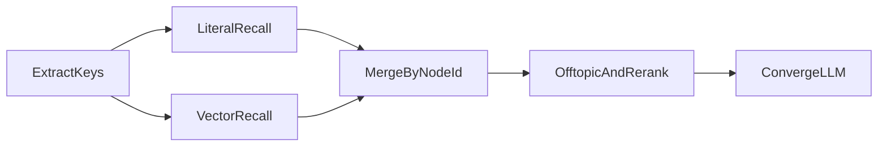

# 第 2 阶段向量召回开发计划（文档）

## 交付物

新增独立文档 `[docs/语义匹配第2阶段_向量召回开发计划.md](docs/语义匹配第2阶段_向量召回开发计划.md)`，并在下列文件加交叉引用：

- `[docs/语义匹配与别名沉淀.md](docs/语义匹配与别名沉淀.md)` 第 4 节改为指向该计划（保留 6 条原则摘要，不再把实施细节挤在原文里）
- `[docs/README.md](docs/README.md)` 文档索引增加一条

**本次只写文档，不改引擎代码。**

## 文档将写清的技术决策（已对照现状）

现状：`[src/ai/tagging/repository.rs](src/ai/tagging/repository.rs)` `recall_nodes` 仅字面/trigram；`[src/ai/provider.rs](src/ai/provider.rs)` `AiProvider` 是解析 LLM；`[src/config.rs](src/config.rs)` 已有 `QWEN_API_KEY` + DashScope compatible-mode；候选队列已改为「教师显式提交才入库」。第 2 阶段只补「零字面重叠」的召回，不把 fuzzy 自动灌进审核。

文档正文结构：

1. **目标与非目标**：覆盖「交集」↔「两个集合的公共元素」；不升 exact；不塞进 `AiProvider`；不自动写 `tag_candidates`。
2. **分步实施**（可按 PR 切开）：
  - 迁移：`CREATE EXTENSION vector` 用 `DO $$ … EXCEPTION` 优雅跳过（比现有 pg_trgm 迁移更稳）；表 `knowledge_node_embeddings` / `tag_embeddings`（`vector(1024)` + `content_hash`）；无扩展时整段 DDL 跳过。
  - 客户端：`src/ai/embedding.rs`，DashScope `text-embedding-v3` 1024 维，复用 `QWEN_API_KEY`；批量、超时、日额度与 `ai_usage_log` 对齐策略。
  - 文本：`name_path + 名称 + 别名`（节点）；标签为 `category + name + aliases`。
  - 索引维护：节点/别名写入后失效重嵌；启动或管理命令全量回填；hash 未变则跳过。
  - 召回：`recall_nodes` 字面 top-k ∪ 向量 top-k；向量命中 `match_type=fuzzy`、建议分约 0.80；确定性 exact/alias 分数优先；随后走现有 `filter_offtopic_candidates` / 收敛。方法/素养标签同样并集，仍不走第二次 LLM。
  - 开关：`TAGGING_VECTOR_RECALL`（默认开，无扩展或无 key 则静默退回第 1 阶段）。
  - 引擎版本：`tagging-v4`（召回集合变了，建议哈希需带版本以免脏复用）。
3. **文件清单**：迁移、`embedding.rs`、改 `repository.rs` / `engine.rs` / `config.rs`、节点与标签写路径钩子、测试、`.env.example`。
4. **测试与验收**：无 pgvector 时集成测试 skip；有扩展时用固定假向量测并集与「不得升 exact」；回归第 1 阶段用例仍过。
5. **风险**：权限不足、配额、离题向量噪声、索引滞后；均写明降级与观测字段（`vector_recalled`、`vector_ms`，不打题文）。

## 不纳入本文档的内容

前端 UI、候选审核页改版、把 embedding 接到 OCR 解析 Prompt。别名闭环仍以第 1 阶段「等于已有 → 审核 → aliases」为主路径。