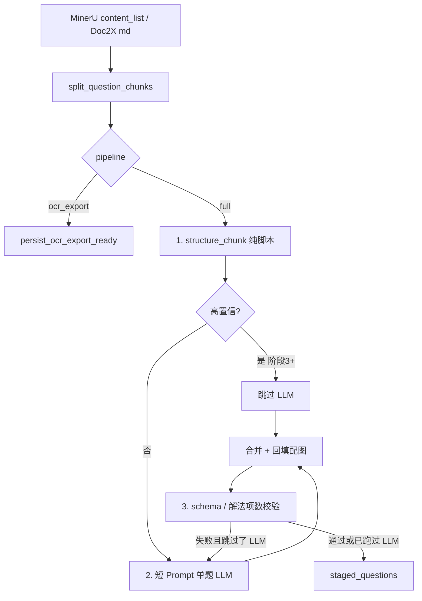

# 全自动：脚本优先结构化

> 明天按阶段执行。每一阶段可独立测试、可单独上线。不要新增第三种录入模式。

**目标：** MinerU / Doc2X OCR 之后，全自动产出可入库的 `ParsedQuestion`：（1）脚本切题干 / 选项 / 配图 / 解法；（2）仅在脚本拿不准时调用 LLM；（3）硬校验，避免豆包式丢掉「法二」或选项残留在题干里悄悄过关。

**架构：** 切大题仍用 [`split_question_chunks`](src/ai/layout/split.rs)。新增 `src/ai/structure/` 模块，把每段 markdown **chunk** 做成 `ScriptDraft`。只接到 [`run_pdf_fast_path`](src/workers/ai_parse_worker.rs) 里、现有 `is_ocr_export` 早退之后。`ocr_export` 仍在 `persist_ocr_export_ready` 停住。导入 JSON 仍走 [`import_questions`](src/handlers/ai_tasks.rs) + cleaner。

**明确不做（锁定）：**

- 不新增 `pipeline` 取值；界面仍是「全自动 / 站外结构化」。
- 不对 `ocr_export` 跑 Stage2 或本结构化器。
- 不削弱导入路径的 `fix_invalid_escapes` / `normalize_llm_latex`。
- 阶段 1–4 不改写单页图路径 `ocr_page_to_json`（整页 LLM 留到可选后续阶段）。
- 不向已约 4 千行的 worker 堆正则；只加薄调用点。



---

## 现状 vs 目标（仅全自动）

今天 OCR 之后（[`run_pdf_fast_path` 约 2000–2050 行](src/workers/ai_parse_worker.rs)）：

- `split_stage2_with_layout` → 每一块 → `parse_stage2_chunk`（完整 / 精简 Prompt）→ `post_process_batch` → 失败则 `draft_question_from_chunk`。

目标：

1. 切题不变（已有 MinerU 版面 vs markdown 回退）。
2. 新增 `structure_chunk(&str) -> ScriptDraft`。
3. 高置信 → 跳过 LLM（阶段 3 起）。低置信 → 短 Prompt、**一题一次**、可附带脚本 JSON 作提示。
4. 合并 + 校验；`draft_question_from_chunk` 仍作最后兜底。
5. 现有 `assign_chunk_images` 仍执行。

[`is_ocr_export` 约 1977 行](src/workers/ai_parse_worker.rs) 必须继续立刻返回。不要在那里调用 `structure_chunk`。

---

## 文件清单

- **新建** [`src/ai/structure/mod.rs`](src/ai/structure/mod.rs) — 对外 API：`structure_chunk`、`ScriptDraft`、`Confidence`。
- **新建** [`src/ai/structure/options.rs`](src/ai/structure/options.rs) — 从题干切开 A–D（以及 A–C / A–E）。
- **新建** [`src/ai/structure/analysis.rs`](src/ai/structure/analysis.rs) — 法一 / 解法二 / 另解标题切分；标题计数。
- **新建** [`src/ai/structure/confidence.rs`](src/ai/structure/confidence.rs) — 保守门控。
- **新建** [`src/ai/structure/validate.rs`](src/ai/structure/validate.rs) — 合并后校验。
- **新建** [`src/ai/structure/merge.rs`](src/ai/structure/merge.rs) — 脚本 vs LLM 合并（阶段 2）。
- **修改** [`src/ai/mod.rs`](src/ai/mod.rs) — `pub mod structure;`。
- **修改** [`src/ai/prompt.rs`](src/ai/prompt.rs) — 阶段 3 增加 `STAGE2_PATCH_PROMPT`（不要改 [`docs/rules-prompts.md`](docs/rules-prompts.md)，那是站外复制用的）。
- **修改** [`src/workers/ai_parse_worker.rs`](src/workers/ai_parse_worker.rs) — 仅 PDF 快路径循环；可选写 `progress.phase`。
- **修改** [`src/handlers/ai.rs`](src/handlers/ai.rs) — 从 `post_process_batch` 的逐题循环抽出 `finalize_parsed_questions`，让脚本草稿共用清洗 / 剥选项残留 / 知识点匹配，不必伪造 LLM JSON。
- **阶段 4 可选前端：** [`frontend/src/composables/useAiParsePolling.ts`](frontend/src/composables/useAiParsePolling.ts)、[`TaskProgressPanel.vue`](frontend/src/views/edit/components/TaskProgressPanel.vue) — 后端若写了 `progress.phase`，展示「规则切题 / Stage2」。

---

## 核心类型（阶段 1 实现）

```rust
pub struct ScriptDraft {
    pub question: ParsedQuestion,  // stem/options/analysis/question_no/type 已填
    pub confidence: Confidence,
    pub reasons: Vec<String>,      // 为何高/低；同时写入 warnings
    pub method_heading_count: usize,
    pub image_urls_in_chunk: Vec<String>,
}

pub enum Confidence { High, Low }
```

`structure_chunk` 必须是**纯函数**（无数据库、无 HTTP），单测不需要 Postgres。

---

## 保守高置信门槛（不要放宽）

以下全部满足才是 `High`，否则 `Low`（必须 LLM）：

- 块内恰好 **一道** 大题题号（复用 `question_start_regex` / 版面辅助；忽略 `(1)(2)` 和 `3.14`）。
- 块内每个 `` 都出现在 stem ∪ options ∪ analysis。
- **选择题：** 连续标签 **A–D**（恰好 4 项）。3 或 5 项 → Low。切开后题干不得再残留 `A.` / `A、`。
- **填空 / 解答：** 行首没有 A–D 选项表；`(1)(2)` 留在题干。
- **解法：** `count_method_headings(chunk) == analysis.len()`。若计数为 0：
  - 非解析卷、空 analysis → 纯选择题卷允许 High；
  - `looks_like_analysis_paper` **没有** 明确的法一 / 法二 / 另解标题时 **永不 High**（整段解析糊在一起）。
- 块不是 6000 字 markdown 大段回退（`split_via == "markdown_fallback"` 且单块巨大）→ 一律 Low。

误判 High 比多打一次 LLM 更糟。

---

## 合并规则（阶段 2）

脚本草稿与 LLM 的 `Vec<ParsedQuestion>` 同时存在时（通常一块一题）：

- 若 LLM 的题干 / 选项 / 答案通过校验则采用 LLM，否则保留脚本。
- 若 `script.method_heading_count > llm.analysis.len()`，**用脚本的 `analysis` 覆盖**（从代码侧补上豆包丢掉的法二+）。
- 合并后始终 `assign_chunk_images(chunk, &mut qs)`。
- 合并 `warnings`；追加 `"规则结构化"` / `"模型补全"` 便于审计。

---

## 阶段计划（按此顺序上线）

### 阶段 1 — 脚本结构化器 + 测试（还不跳过 LLM）

**交付：** `structure_chunk` 能跑通 markdown 夹具。Worker 仍对每块调 LLM。可选只打 tracing 记录草稿置信度。

**抽取器：**

选项 — 行首模式：`A.` `A、` `A．` `A)` `(A)`，然后 B/C/D。在第一个 A 处截断题干。思路同 [`OPTIONS_RESIDUE_RE`](src/handlers/ai.rs)（约 105–110 行），但要**抽成** `ParsedOption { label, content }`，不能只剥离。

解法 — 按标题切开（行首或 `【解析】` 之后）：

- `解法一/二/三…` `方法 1/2` `法一/法二` `另解` `别解`
- 标题用原文；正文直到下一标题或下一题号。
- 有 `【解析】` / `【分析】` 但没有法 N → 一项 analysis，标题 `解析`（置信度 Low）。

另外：从第一处题号取 `question_no`；`guess_chunk_question_type` 可迁到这里；收集 `image_urls`；对 stem / options / analysis 调用 `sanitize_question_markup`，尽早把 `$` / `\(` 规范化。

**测试** 放在 `src/ai/structure/`（表驱动 markdown，不调 LLM）：

- 选择题：题干 `"下列结论正确的是"` + A–D；options 填满；stem 无 `A.`。
- 带图选择题：`` 留在 stem，并列入 `image_urls`。
- 解析卷：法一 + 法二 + 另解 → `analysis.len()==3`，均未截断。
- `(1)(2)` 留在题干，不进 analysis。
- 说明行 `1.答卷前` 不是大题（切题已覆盖；结构化器不得臆造第二题）。
- 解析卷整段无 法 N → Low。
- 一块里两个题号 → Low，不得并成一道题干。

**Worker：** 行为不变，最多加 `tracing::info!(confidence, method_heading_count)`。

**验收：** `cargo test --lib structure`（现有 layout / cleaner 测试仍通过）。

---

### 阶段 2 — LLM 之后校验 + 合并（仍每块 LLM）

**交付：** LLM 不能默默丢掉解法或把 A–D 留在题干。脚本是安全网。

**`validate.rs`：**

- Schema：`question_type` 属于 `choice|fill|solution|multiple`；题干非空；High 时选择题必须 4 个选项（Low 可以不完整）。
- `method_heading_count` 与 `analysis.len()` 不一致 → warning，阶段 3 门控视为 Low。
- 选项残留：经抽出的 `finalize_parsed_questions` 调用现有 `strip_options_residue_from_stem`。
- LaTeX：沿用 `sanitize_question_markup` / `normalize_llm_latex`（不要再写一套转义）。

**`merge.rs`：** 实现上面的合并规则。

**Worker 改动** 在 `parse_stage2_chunk`（或新包装 `structure_then_stage2`）：

1. `let draft = structure_chunk(chunk);`
2. 现有 LLM + `post_process_batch`。
3. `merge_script_and_llm(chunk, draft, llm_qs)`。
4. `validate_structured`；解法项数失败且脚本更全时恢复脚本 analysis。
5. LLM 致命失败时的草稿兜底 —— 若脚本已有选项 / 解法，**优先用脚本题，不要空 OCR 糊**（优于今天的 `options: None` 草稿）。

**此时仍不要跳过 LLM。**

**测试：** LLM JSON 只有一项 analysis、原文有法一/法二 → 结果为 2。选择题 LLM 把 A–D 留在题干 → 残留被剥掉。

**验收：** `cargo test --lib structure`，以及 worker 的 `test_draft_from_chunk_*` 仍过；再加一条 merge 测试。

---

### 阶段 3 — 高置信跳过 LLM + 低置信短补丁 Prompt

**交付：** 高置信选择题 / 简单题 0 token。低置信用**短** Prompt，一次一题。

**Worker 循环**（[`run_pdf_fast_path` 批处理](src/workers/ai_parse_worker.rs) 约 2029–2053 行）：

- 每块：先 structure → 若 `High`，`finalize_parsed_questions` + 配图，不调 provider。
- 若 `Low`，用 `STAGE2_PATCH_PROMPT`（新建，**不要**整份 `CORE_PARSE_RULES`）：
  - 输入：本块 markdown + 可选脚本 JSON。
  - 输出：裸 `{ "questions": [ 一项 ] }`。
  - 规则：不解法项；不编造答案；只用 `$...$`；保留 ``。
- 解析卷：补丁 Prompt 里保留「几种解法几项」一句；没有 法 N 标题仍永不 High。
- 保留 `parse_stage2_chunk` 的 2 次重试 / 致命错误 / 取消。
- 若跳过 LLM 后校验失败 → **回退打 LLM**（不要把坏的 High 草稿入库）。

**不要改** [`docs/rules-prompts.md`](docs/rules-prompts.md)（站外复制源）。应用内补丁 Prompt 只放 `prompt.rs`。

**测试：**

- High 草稿不需要 provider（单测门控：`should_call_llm(&draft) == false`）。
- 低置信解析卷 `should_call_llm == true`。
- 校验失败的 High 强制走 LLM（单测分支，不打真实 API）。

**验收：** 现有 `test_split_stage2_*` 不变；新门控测试；`cargo test --lib`。

---

### 阶段 4 — 进度、回归、上线清单

**后端：** 写 `progress.phase` = `structuring` | `stage2` | `ocr`（OCR 阶段本已有）。计数：`processed_count` 仍按入库题。日志：`split_via`、`high_skip_n`、`llm_n`。

**前端（小改）：** `phase === 'structuring'` 显示「正在规则切题…」；`stage2` 仍「AI 正在解析…」。不加新单选。[`useAiParsePolling.ts`](frontend/src/composables/useAiParsePolling.ts) 已按 `ocr_export` 分支。

**回归（阶段 3 上生产前必须过）：**

- 提交 `pipeline=ocr_export` → 仍是 `phase=ocr_ready`，**零** Stage2 / 跳过结构化副作用，导入题目仍可用。
- `pipeline=full` 的 PDF 路径走 structure + 门控。
- 导入含 `\(` / `\triangle` 的 JSON 仍被修复（现有 `ai_tasks` 测试）。

**手工（执行时）：** 一份高考选择题 PDF、一份带法一/法二的解析卷；确认全自动预览；确认站外 OCR 页 + 粘贴 JSON。

---

### 阶段 5 — 可选后续（阶段 1–4 完成前不要做）

统一 **单页回退** [`ocr_page_to_json`](src/workers/ai_parse_worker.rs)：把各页 OCR 拼起来 → 版面切题 → 同一套 `structure_then_stage2`，替代整页 LLM。前四阶段不做，好让全自动 PDF（MinerU / Doc2X）先落地。

---

## 执行时注意

- **每阶段 TDD：** 先在 `src/ai/structure/*.rs` 的 `#[cfg(test)]` 写失败测试，再实现。运行 `cargo test --lib structure -- --nocapture`。
- **不要** 在 `ai_parse_worker.rs` 里堆正则；`use crate::ai::structure`。
- **复用** [`src/ai/layout/mod.rs`](src/ai/layout/mod.rs) 的 `question_start_regex` / `is_instruction_numbered_line`，不要复制 worker 里那套；若 worker 辅助函数是私有 `fn`，可从 `layout` 导出，重复代码以后再删（阶段 1 不必做）。
- **`finalize_parsed_questions`：** 把 [`post_process_batch`](src/handlers/ai.rs) 的逐题主体（清洗、剥选项、空 analysis 占位、知识点匹配）抽成 `pub(crate) async fn finalize_parsed_questions(qs: Vec<ParsedQuestion>, pool: &PgPool)`。`post_process_batch` 仍作 LLM 与导入的 JSON 入口。脚本 High 路径直接调 finalize。
- **提交：** 每阶段一次 Conventional Commit，例如 `feat(ai): script-structure chunks before Stage2`、`feat(ai): merge script analysis when LLM drops methods`、`feat(ai): skip Stage2 on high-confidence chunks`、`feat(ai): full-auto progress phase for structuring`。
- **可选开关：** 环境变量 `MATHSET_ALWAYS_STAGE2=1` 强制走 LLM，便于线上调门控。阶段 3 测试通过后默认关闭。

---

## 需求对照

- 脚本：切题已有；抽图 / 选项 / 解法 → **阶段 1**
- 仅对低置信调用 LLM → **阶段 3**
- Schema / 转义 / 解法项数校验 → **阶段 2**（外加现有 cleaner）
- 站外流程不变 → **阶段 4 回归** + 永不改早退
- 保守门控 / 解析卷 → **阶段 1 置信度 + 阶段 3**
- 空草稿时优先用脚本 → **阶段 2**
- 高置信校验失败 → LLM → **阶段 3**
- 不增加第三种录入模式 → **全程**
