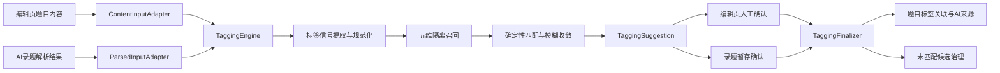

# 智能打标签统一改造详细计划

## 目标与范围

本次改造统一当前两条链路：

- 编辑页 `POST /questions/ai-tagging`：同步两阶段 RAG，只回填、不直接落库。
- AI 录题 Worker：从 `ParsedQuestion` 取标签信号，只匹配章节和知识点，确认保存后才落库和写候选。

目标是让两条链路共享同一套分类维度、召回规则、匹配阈值、结果协议、来源追踪和候选治理；交互方式仍可分别保持“编辑页建议回填”和“录题暂存确认”。后续再把编辑页调用迁移为异步任务，统一配额、超时和重试。

非目标：不在第一阶段重写 OCR/资料分类，不自动覆盖用户人工标签，不在未确认保存前创建正式标签或候选。

## 目标架构

统一分类口径：

- `chapter`：`knowledge_nodes`，章节允许选择非叶子节点。
- `knowledge`：`knowledge_nodes`，只允许活动叶子节点。
- `pattern`：`knowledge_nodes`，对应 `knowledge_trees.kind=ability`，只允许活动叶子节点。
- `method`：`tags.category=method`，不得进入题型专题树。
- `core_competence`：`tags.category=core_competence`，按封闭词表匹配。

## 第一阶段：冻结统一契约与数据库扩展

### 1. 建立统一领域类型

在 `[src/ai/tagging/mod.rs](src/ai/tagging/mod.rs)`、`[src/ai/tagging/types.rs](src/ai/tagging/types.rs)` 定义：

- `TaggingInput`：支持原始题文和已有 `ParsedQuestion` 两种输入。
- `TaggingSignals`：章节、知识点、题型专题、通用方法、核心素养及推断属性。
- `TaggingContext`：用户、空间、来源、任务和题目上下文。
- `TaggingPolicy`：节点约束、召回上限、匹配阈值、是否执行 LLM 收敛。
- `TaggingSuggestion`：五维匹配结果、未匹配项、推断属性、引擎版本和输入摘要。
- `TaggingMatch`：统一携带 `target_type`、`dimension`、目标 ID、名称、分数、匹配类型和置信度。

维度和目标类型使用 Rust enum，避免当前 `method`、`pattern`、`ability` 字符串混用。

### 2. 新增建议记录

增加一条新迁移，例如 `[migrations/20260820000001_unify_ai_tagging.sql](migrations/20260820000001_unify_ai_tagging.sql)`：

- 新建 `ai_tagging_suggestions`：`id`、`creator_id`、`space_id`、可选 `question_id`、可选 `source_task_id`、`source_index`、`input_hash`、`engine_version`、`status`、`result JSONB`、`created_at`、`applied_at`。
- 状态至少包含 `pending/applied/discarded/expired`。
- 对任务暂存来源建立幂等唯一索引。
- 建议记录只保存输入哈希和结果，不重复保存完整题文。

这样编辑页和 Worker 都能返回同一种 `suggestion_id`，保存时由后端验证归属并重放确认逻辑。

### 3. 扩展来源追踪与候选模型

同一迁移中：

- 为 `question_tags_relation` 增加 `source`、`ai_confidence`、可选 `suggestion_id`，使通用方法和核心素养也能追踪 AI 来源。
- 为 `question_knowledge_nodes` 增加可选 `suggestion_id`；保留现有 `source/ai_confidence`。
- 为 `tag_candidates` 增加 `target_type`，区分 `knowledge_node` 与 `tag`；增加可选 `suggested_tag_id`。
- 为 `tag_candidates.kind/status/target_type` 增加 CHECK，明确 `chapter/knowledge/pattern/method/core_competence`。
- 修正 NULL 幂等问题：分别为有任务和无任务候选建立部分唯一索引。
- 兼容回填：历史 `chapter/knowledge/pattern` 归为 `knowledge_node`，`method/core_competence` 归为 `tag`。

迁移必须保持旧接口可读，便于分阶段切换与回滚。

## 第二阶段：抽取共享 TaggingEngine

### 1. 拆分当前 Handler 中的业务逻辑

将 `[src/handlers/ai_tagging.rs](src/handlers/ai_tagging.rs)` 缩减为鉴权、请求校验和响应映射。把以下逻辑迁入：

- `[src/ai/tagging/prompts.rs](src/ai/tagging/prompts.rs)`：发散提取和候选收敛 Prompt。
- `[src/ai/tagging/repository.rs](src/ai/tagging/repository.rs)`：知识树和扁平标签召回。
- `[src/ai/tagging/engine.rs](src/ai/tagging/engine.rs)`：输入适配、召回、收敛、结果构建和建议持久化。

保留临时兼容导出，使 `[src/handlers/ai.rs](src/handlers/ai.rs)` 与 `[src/workers/ai_parse_worker.rs](src/workers/ai_parse_worker.rs)` 可逐步迁移，不在同一提交中一次性删除旧函数。

### 2. 统一召回规则

知识树查询统一执行：

- 名称精确匹配 `1.0`，alias 精确匹配 `0.95`，模糊匹配最低 `0.3`。
- 只使用活动树和 `status='active'` 节点，排除 merged/deprecated/rejected。
- 全局空间与当前可访问空间隔离。
- `chapter` 不加叶子约束；`knowledge/pattern` 加活动叶子约束。
- `pattern` 严格限定 `tree.kind=ability`。
- 合并节点在查询和保存时解析到最终 canonical 节点；节点合并时将源名称与 aliases 迁移到目标。
- 添加 `knowledge_nodes.name`、`tags.name` 的 pg_trgm 索引，并用 `EXPLAIN ANALYZE` 验证召回不退化成大范围顺序扫描。

### 3. 统一确定与收敛策略

降低第二次 LLM 的成本和误标风险：

- exact/alias 可直接确定，不再交给第二次 LLM。
- fuzzy 或同分歧义候选才进入收敛 Prompt。
- 收敛结果后端再次校验目标 ID/名称必须来自候选集。
- 收敛 JSON 损坏时不再静默采用每维 Top1；返回候选与 `needs_review=true`。
- 后端强制数量上限，不能只依赖 Prompt：章节 3、知识点 3、题型专题 3、通用方法 5、核心素养 3；常量集中配置。
- 所有未匹配项保留 `raw_name/normalized_name/dimension/confidence/reason/eligible_for_candidate`。

### 4. 两种输入适配

- `ContentInputAdapter`：编辑页题文执行标签信号提取，并返回难度、题型、年级和认知层次。
- `ParsedInputAdapter`：Worker 复用 `ParsedQuestion.chapter_path/knowledge_points/solution_methods`，补充题型专题与核心素养信号；之后进入同一召回与收敛管线。
- 两种适配器必须共享规范化器和维度校验。统一目标是同一信号得到相同匹配结果；不要求 OCR 提取与独立题文提取逐字一致。

## 第三阶段：接入编辑页同步打标

### 1. 升级 API 协议

在 `[src/handlers/ai_tagging.rs](src/handlers/ai_tagging.rs)` 和 `[frontend/src/api/client.ts](frontend/src/api/client.ts)` 中升级 `POST /questions/ai-tagging`：

- 请求继续接受 `content/space_id`，可增加可选 `question_id`。
- 响应增加 `suggestion_id/engine_version/dimensions/unmatched/needs_review`。
- 兼容期继续填充旧字段 `knowledge_nodes/competency_tags/method_tags`，前端切换完成后再移除。
- 返回建议记录，不直接写题目关联和候选。

### 2. 前端统一消费结果

修改 `[frontend/src/views/edit/components/AttributeSidePanel.vue](frontend/src/views/edit/components/AttributeSidePanel.vue)`、`[frontend/src/views/QuestionEdit.vue](frontend/src/views/QuestionEdit.vue)`：

- 按响应中的 `dimension` 分发，不再依赖 `treeList` 成功加载后根据 `tree_id` 猜测 kind。
- 在表单快照中保存 `suggestion_id` 和本次 AI 建议 ID 集合。
- 用户已有选择与 AI 建议取并集，但服务端和前端同时执行数量上限。
- 将 `grade_level/cognitive_level` 映射到真实表单或 metadata，不再只写高亮标记。
- 增加未匹配建议区域；用户可勾选哪些名称进入候选治理，默认不自动提交低置信度词。
- 手工修改后只清除该项 AI 来源，不影响其他建议。
- API 兼容期为该请求单独提高超时；异步任务上线后删除长同步超时。

### 3. 统一确认保存与来源

扩展 `[src/models/question.rs](src/models/question.rs)` 的创建/更新请求，增加可选 `ai_tagging_confirmation`：

- `suggestion_id`
- 用户确认进入候选队列的 unmatched 项 ID

在 `[src/handlers/questions.rs](src/handlers/questions.rs)` 中新增统一 `TaggingFinalizer`：

- 校验建议归属、空间、状态和输入上下文。
- 以最终 `knowledge_node_ids/tag_ids` 为准，与建议结果求交集。
- AI 建议且用户未修改的关联写 `source='ai'`、置信度和 `suggestion_id`。
- 用户新增或改选关联写 `source='manual'`。
- 题目、关联、建议状态和可失败的候选创建尽可能置于清晰事务边界；候选失败可记录告警并由补偿任务重试。
- 同一个建议只能应用一次；重复请求返回幂等结果。

## 第四阶段：接入 AI 录题 Worker

### 1. Worker 改用统一 Engine

修改 `[src/workers/ai_parse_worker.rs](src/workers/ai_parse_worker.rs)`：

- OCR 和结构化逻辑保持不变。
- 删除 Worker 自己的 chapter/knowledge 双循环匹配，改为调用 `ParsedInputAdapter + TaggingEngine`。
- 将统一 `suggestion_id`、五维 matched/unmatched、engine_version 写入 `staged_questions`。
- 不在暂存阶段创建 `tag_candidates`。
- 题型专题和通用方法从此走与编辑页一致的召回体系。

### 2. 暂存转表单统一协议

修改 `[frontend/src/views/edit/components/AiRecognizeDialog.vue](frontend/src/views/edit/components/AiRecognizeDialog.vue)`：

- `stagedToParsed` 消费统一 suggestion，而不是旧 `matched/unmatched` 特殊结构。
- 快照携带 suggestion ID、AI 建议 ID 和未匹配选择。
- 使用响应维度直接分发章节、知识点、专题和 tags。
- 移除解析完成时不准确的 `pending_candidate_count` 成功提示；改为提示“发现 N 个未匹配建议，确认保存后提交审核”。
- 显示 `existing_question_id`，让用户选择复用已有题目或放弃重复创建。

### 3. 统一首次保存

保留现有 `ai_meta` 用于暂存项归属、容器关联和防重复保存；标签确认改由 `TaggingFinalizer` 完成：

- `ai_meta` 负责任务和暂存来源。
- `ai_tagging_confirmation` 负责标签建议和候选确认。
- 容器关联、暂存 `saved` 标记与 suggestion 应用保持幂等。
- 删除 `[src/handlers/questions.rs](src/handlers/questions.rs)` 中仅适用于录题的 AI 节点覆盖代码，以及保存后的分散候选循环。

## 第五阶段：重构候选治理

### 1. 后端按目标类型分支

修改 `[src/handlers/tag_governance.rs](src/handlers/tag_governance.rs)`、`[src/models/tag_governance.rs](src/models/tag_governance.rs)`：

- `knowledge_node` 候选：创建节点、添加节点 alias 或合并到 canonical 节点。
- `tag` 候选：创建 `tags`、添加 tag alias 或并入已有 tag。
- 验证候选维度与目标树 kind/category 一致，禁止章节候选挂到知识点或专题树。
- `new_node` 校验 parent 必须属于目标 tree；允许前端指定父节点。
- 所有审批变更、题目关联、计数和审计使用同一数据库事务。
- 只有实际新增题目关联时才增加 `question_count/use_count`。
- `new_node/alias` 后状态为 `approved`；保留 `merge` 时状态明确为 `merged`，并统一前后端文案。
- 拒绝原因和审核备注实际持久化。

### 2. 管理端按维度约束交互

修改 `[frontend/src/views/TagCandidateReview.vue](frontend/src/views/TagCandidateReview.vue)`、`[frontend/src/components/KnowledgeTreeCascader.vue](frontend/src/components/KnowledgeTreeCascader.vue)`：

- 根据 `target_type/dimension` 只展示合法目标。
- 创建知识节点时可选择目标树和父节点。
- method/core_competence 候选使用 tags 选择器，不显示知识树级联器。
- 发送拒绝原因；区分“别名接受”和“合并”语义。
- 修复 merged 筛选与后端状态一致性。

## 第六阶段：编辑页异步任务化

在前五阶段稳定后再执行，避免同时改业务语义和执行模型。

### 1. 新建独立打标任务

不要复用与 Document 强耦合的 `ai_parse_tasks`。新增迁移和模型：

- `ai_tagging_tasks`：输入哈希、用户、空间、可选题目、状态、重试次数、错误、suggestion_id、心跳和时间戳。
- 状态采用 `pending/processing/retrying/success/failed/cancelled`。
- 同一用户、空间和输入哈希的进行中任务幂等复用。

新增接口：

- `POST /questions/ai-tagging-tasks` 返回 202 和 task ID。
- `GET /questions/ai-tagging-tasks/{id}` 返回状态和 suggestion。
- `POST /questions/ai-tagging-tasks/{id}/cancel`。

### 2. 接入 Worker 与前端

- Worker 复用同一个 `TaggingEngine`，设置心跳和最多两次可重试上游错误。
- 明确区分不可重试的配置/权限错误与可重试的 429、5xx、超时、格式损坏。
- 编辑页使用轮询或 SSE 展示阶段状态；超时不再依赖 Axios 10 秒限制。
- 同步接口保留一个版本周期作为回退，通过 feature flag 切换。
- 打标任务与 AI 录题使用统一配额服务和模型调用审计，但可配置不同额度权重。

## 第七阶段：测试、观测与渐进发布

### 1. 后端测试

扩展 `[src/handlers/ai_tagging.rs](src/handlers/ai_tagging.rs)` 单元测试，并新增集成测试文件，例如 `[tests/ai_tagging_api.rs](tests/ai_tagging_api.rs)`：

- 五维输入和结果序列化。
- exact/alias/fuzzy 优先级与阈值。
- 章节可匹配父节点；知识点/专题只匹配叶子。
- 空间隔离、inactive/merged/canonical 处理。
- 收敛幻觉丢弃和 JSON 损坏返回待确认，不自动 Top1。
- 服务端数量上限。
- 同一 signals 经编辑适配器和 Worker 适配器得到一致匹配。
- suggestion 归属、单次应用、重复保存幂等和来源追踪。
- 未确认不写候选；确认保存才写候选。
- node/tag 两类候选的新建、别名、合并、拒绝和事务回滚。
- 计数只在实际新增关联时变化。

扩展 `[tests/tag_governance_api.rs](tests/tag_governance_api.rs)` 覆盖目标类型和维度校验。

### 2. 前端验证

至少覆盖：

- 新建题、已有题、AI 录题暂存三种场景。
- 树列表加载失败时仍按后端维度正确分发。
- AI 标签不突破限额。
- 用户删除 AI 建议后保存为未关联，不被 Finalizer 恢复。
- 年级和认知层次真实持久化。
- 未匹配建议选择与候选数量提示。
- 任务超时、重试、取消和页面恢复。

执行现有前端 type-check/build；若仓库已有单测框架，为结果映射和快照恢复补充单元测试。

### 3. 观测与发布

使用 `tracing` 记录且不输出题目原文：

- `engine_version`、输入来源、各维召回/命中/未匹配数量。
- 两次模型调用耗时、数据库召回耗时、建议接受率。
- 候选创建率、审批通过率、别名命中率。
- 同步超时、异步重试和失败分类。

渐进发布顺序：

1. 先上线兼容数据库迁移和新 Engine，不切流量。
2. 用相同 signals 影子比较旧匹配器与新 Engine，记录差异但不重复调用 LLM。
3. 切换 AI 录题 Worker，观察候选量和误匹配率。
4. 切换编辑页同步接口，保留旧响应字段和回退开关。
5. 稳定后上线异步打标任务并切换前端。
6. 最后删除旧 matcher、旧 staged 结构、旧响应字段和死代码，更新 `[docs/requirements.md](docs/requirements.md)` 与 `[README.md](README.md)`。

## 验收标准

- 同一组标签信号在编辑页与 Worker 中得到相同节点/tag 匹配结果。
- 两条链路都支持章节、知识点、题型专题、通用方法和核心素养。
- 所有 AI 关联可追溯到 suggestion、分数和来源；人工修改不会被标为 AI。
- 未确认建议不落库、不进候选；确认保存后候选幂等产生。
- method 候选进入 `tags`，pattern 候选进入 ability 知识树，不再混用。
- 章节父节点可命中，merged/inactive 节点不会成为最终标签。
- 数量上限由服务端强制执行。
- 候选审批事务一致，关联计数准确。
- 编辑页异步化后不再受默认 10 秒请求超时影响，并具备配额、重试、取消和恢复能力。
- 后端集成测试、现有 Rust 测试、前端 type-check/build 全部通过。

