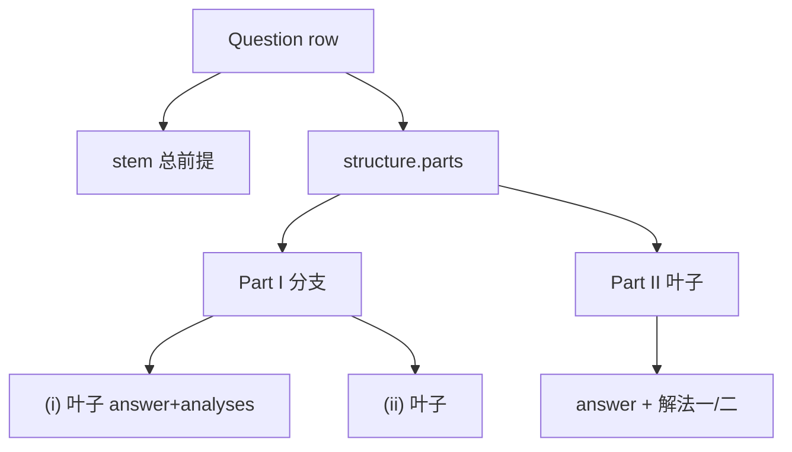

# 解答题嵌套结构实施计划

## 约束（已拍板）

- 试卷粒度不变：第 17 题仍是一行 `questions`，不拆 `parent_id`。
- 页面仍是「编辑 | 预览 | 属性」三列；结构树进**左栏**，禁止第四列。
- 无旧数据兼容：`structure` 为解答题唯一结构；不双写扁平 `subs` / `---`  拼接。
- 选择题/填空题的 `correct_answer` + `analysis` TEXT 不动。
- 本期不做叶子知识点、叶子分值（仍挂整题）。

## 数据模型

新增列 `questions.structure JSONB NULL`。仅 `question_type = solution` 写入，其它题型恒为 `null`。

```ts
type AnalysisBlock = { id: string; title: string; content: string }

type QuestionPart = {
  id: string            // 题内 UUID，不用下标
  label: string         // "(1)" | "I" | "(i)"，可改
  stem: string          // 本层局部题干；叶子可空
  children: QuestionPart[]
  // 仅叶子：children.length === 0
  answer?: string
  analyses?: AnalysisBlock[]
  no_analysis_needed?: boolean
}
type QuestionStructure = { version: 1; parts: QuestionPart[] }
```

规则：`children.length > 0` 为分支（禁止答案/解法）；叶子才有答案与多种解法。深度上限 2 层问（总干 + I + i），再加点「添加子问」禁用。

单问计算题：`parts` 恰好 1 个空 `stem` 的叶子；UI 不显示树铬合金，表现与现在一致。点「增加小问」才出现卡片树。

解答题落库：`correct_answer` / `analysis` 写 `NULL`。`metadata.system_flags.no_analysis_needed` 改为由叶子聚合（全部叶子勾选才为 true）。

编号默认：第 1 层 `(1)(2)`，第 2 层 `(i)(ii)`；添加/删除后按层重排 label（已手动改过的 label 可保留，实现时用 `labelDirty` 或仅自动填新建节点）。




## 后端

迁移：`ALTER TABLE questions ADD COLUMN structure JSONB;` 可选 `CHECK (structure IS NULL OR question_type = 'solution')`。

类型与遍历：在 [src/models/question.rs](src/models/question.rs) 增加 `QuestionPart` / `QuestionStructure`；`Question` / `CreateQuestionRequest` / `UpdateQuestionRequest` / `QuestionDetail` 加 `structure`。抽出：

- `walk_leaves` / `is_solution_answer_empty(structure)`
- `is_solution_analysis_missing(structure)`（某叶子无解法且未 `no_analysis_needed`）

改 [src/models/question.rs](src/models/question.rs) 的 `refresh_system_flags` 与 [src/handlers/questions.rs](src/handlers/questions.rs) 的 `validate_question_completeness`：解答题走树，其它题型走原逻辑。

Hash：[src/util/normalize.rs](src/util/normalize.rs) 对解答题用「规范化 stem + 稳定序列化的 structure（canonical JSON，key 排序）」；`normalized_content_hash` **去掉各叶 `analyses`**，与现「不含解析」一致。选择题/填空仍用 `answer`/`analysis`。[src/bin/backfill_question_hashes.rs](src/bin/backfill_question_hashes.rs) 与 worker 查重同步。

配图：`extract_image_filenames` 扫描 `structure` 内所有 `stem` / `answer` / `analyses.content`。

写路径：创建/更新/复制三处 `INSERT INTO questions` 必须带 `structure`：

- [src/handlers/questions.rs](src/handlers/questions.rs) 创建、更新、`copy_question`
- [src/handlers/spaces.rs](src/handlers/spaces.rs)
- [src/handlers/public_library.rs](src/handlers/public_library.rs)

试卷接口 [src/handlers/papers.rs](src/handlers/papers.rs) 的题目摘要若返回 `analysis`，解答题改为带 `structure`，供试卷页缩进渲染。

## 前端录入（左栏，不增列）

共享类型与编号工具：新建 `frontend/src/utils/questionParts.ts`（默认叶子、加兄弟/加子问、深度检查、路径文案）。

重写 [frontend/src/views/edit/components/EditFormSolution.vue](frontend/src/views/edit/components/EditFormSolution.vue)：

- 左栏内缩进卡片：分支只显示 label + 局部题干；叶子展开后才显示答案 + 解法一/二 + 无需解析。
- 同时只展开一个叶子（`expandedId`）。
- 操作：添加大问、添加子问、删除、升级叶子为分支（原答案迁到第一个子问）。
- 顶部一行面包屑 `总干 / I / (i)` + 同层芯片（可横滑），不占第四列。
- `parts.length === 1` 且无子问、无局部题干时隐藏树外壳，只保留答案/解法。

[frontend/src/views/QuestionEdit.vue](frontend/src/views/QuestionEdit.vue)：

- `form.parts` 替代解答题的 `sub_answers`；解法从整题 `form.solutions` 下放到叶子（选择题/填空仍用 `form.solutions` → `analysis` TEXT）。
- `buildPayloadFromSource`：解答题提交 `{ structure, correct_answer: null, analysis: null }`。
- 配图/blob 持久化、插入并排图组：目标改为当前展开叶子的题干/答案/解法。
- `panelCollapsed`：`innerWidth < 1440` 默认 `true`。
- `<1200px`：`main-content` 内「编辑 | 预览」分段，避免三列挤死（属性面板保持可折叠）。

## 展示面

- [frontend/src/views/edit/components/LivePreviewCard.vue](frontend/src/views/edit/components/LivePreviewCard.vue)：总干 + 缩进问；每叶自己的答案与解法切换；点击某问通知左栏展开对应卡片。
- [frontend/src/views/QuestionDetail.vue](frontend/src/views/QuestionDetail.vue)、[frontend/src/views/QuestionList.vue](frontend/src/views/QuestionList.vue)、[frontend/src/views/PaperDetail.vue](frontend/src/views/PaperDetail.vue)：解答题按树渲染；列表卡片可只显示总干 + 角标「n 问」。
- [frontend/src/views/edit/components/AttributeSidePanel.vue](frontend/src/views/edit/components/AttributeSidePanel.vue) 打标文本：拼接总干 + 各问 stem/answer/analyses。
- [frontend/src/api/client.ts](frontend/src/api/client.ts) 补 `structure` 类型。

## AI 解析（与入库同期）

[src/ai/types.rs](src/ai/types.rs) / [frontend/src/api/client.ts](frontend/src/api/client.ts) 的 `ParsedQuestion` 增加 `parts`。

改 [src/ai/prompt.rs](src/ai/prompt.rs)：

- `stem` 只放总前提（不再强制「所有小问塞进 stem」）。
- 输出 `parts` 树；叶子对齐 `answer` + `analyses`；无嵌套则 `parts` 一个叶子。
- 整题级 `analysis` / `correct_answer.subs` 对解答题不再作为结构来源（可空，避免模型双写打架）。

[src/workers/ai_parse_worker.rs](src/workers/ai_parse_worker.rs)：图片占位符、外链本地化、hash、暂存 JSON 都走 `parts`。前端 [AiRecognizeDialog.vue](frontend/src/views/edit/components/AiRecognizeDialog.vue) 把 `parts` 填进 `form.parts`。

[frontend/src/utils/parseMarkdown.ts](frontend/src/utils/parseMarkdown.ts)：`(1)(2)` 映射为同层叶子；解法按小问切开挂到对应叶（本期不解析罗马数字嵌套，缺则一层树，人手再缩进）。

回归样例：用图 2（I 下两小问 + 独立 II）、图 3（独立 I + II 下两小问）各写一条 fixture / 组件用例。

## 测试

更新解答题夹具（`correct_answer.subs` + `analysis` 字符串 → `structure`）：[tests/api.rs](tests/api.rs)、[tests/documents_api.rs](tests/documents_api.rs)、[tests/collections_api.rs](tests/collections_api.rs)、[tests/ai_tagging_api.rs](tests/ai_tagging_api.rs) 等。新增：嵌套完整性校验、hash 不含解法、创建/详情 round-trip 图 2 结构。

## 明确不做

- `parent_id` 拆题、双写拍平、存量迁移。
- 叶子知识点 / 叶子分值 / 叶子评分标准。
- 改知识树、试卷关联表、审核状态机。

