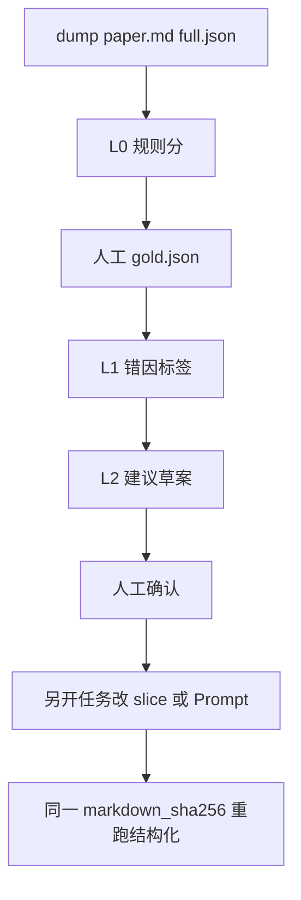

# 全自动解析质量评估闭环：可执行计划

依据 [docs/全自动解析质量评估_闭环可行性.md](docs/全自动解析质量评估_闭环可行性.md) §8。单位按**题**计。不改 [src/ai/slice](src/ai/slice)、不改 [docs/rules-prompts.md](docs/rules-prompts.md)；裁判/建议脚本不得写回仓库（需求分析 C6）。




---

## 第 1 周：评测可复现（P0-1～6）

在修完之前：`--reuse` 不能当结构回归；规则分失败率不能拿去改正则/Prompt；V0 不可冻。

### P0-1 `--reuse` 必须跳过 MinerU

现状：[scripts/bench_full_auto_parse.py](scripts/bench_full_auto_parse.py) `run_bench` 在 `--reuse` 时仍 `create_parse_task`；worker 只读**本任务** `progress.ocr_markdown`（[src/workers/ai_parse_worker.rs](src/workers/ai_parse_worker.rs) `cached_ocr_markdown`），新任务必再 OCR。

做法（不加题目列、不改切题）：

- Worker：同 `document_id` 已 completed 任务若有 `ocr_markdown`，新任务复制 markdown + `ocr_engine`，跳过 MinerU；可选 `force_ocr` 才重跑。
- 脚本：`--reuse` 继续复用 `document_id`，日志明确「跳过 OCR」；无缓存则失败退出，禁止默默重跑。
- 改正 [bench/inbox/PUT_PDFS_HERE.txt](bench/inbox/PUT_PDFS_HERE.txt) 与 [bench/eval/README.txt](bench/eval/README.txt)。

GET `/ai/parse-task/{id}` 补映射 `ocr_engine`（已在 progress，响应未露出）。

### P0-2 题号允许多段

[slice_paper](scripts/bench_eval_quality.py) 现用 `dict`，填空从 1 再起会覆盖选择 1–8。改成列表 `[(section, no, md)]` 或 `no` 带大题前缀；`align` 按 `(前缀, 规范化题号)` 对齐，同号多段保留。`self_check` 加「1–8 后再 1」用例。

### P0-3 禁止双向子串答案

[score_answer](scripts/bench_eval_quality.py) 现 `gold_n in cand or cand in gold_n`。改为：按小问/`【答案】`分段对齐后规范化**全等**；选择仍字母全等。`self_check`：叶子 `"1"` 不得对上 `（1）1（2）2`。

### P0-4 选择题只认选项表

[paper_is_choice](scripts/bench_eval_quality.py) 现搜正文 `A.`。改为只认行首 `A.`/`A、` 连续选项表（≥2 行或同行 `A. … B. …`）。`self_check`：「点 A」「集合 A」的解答题不得判 choice。

### P0-5 dump 与 export 绑定 OCR hash

[dump_eval_paper](scripts/bench_full_auto_parse.py) 覆盖 `paper.md`/`full.json` 留下旧 `export.json`。若新 `markdown_sha256` ≠ `meta.json` 旧值：把 `export.json` 改名为 `export.stale.json` 或删除，并清空 `meta.export`。禁止新 OCR 配旧站外 JSON。

### P0-6 无 export 可单边评分

[eval_paper](scripts/bench_eval_quality.py) 缺 `export.json` 现整卷 `import_failure`。[main](scripts/bench_eval_quality.py) 遇失败 `exit 1`。改为：缺 export 仍评 full vs `paper.md`，export 侧为 `na`，shunt 不计 `export_missed_prompt`；`report_latest.json` 跨卷加权（按题数）。仅缺 `paper.md`/`full.json` 才 `import_failure`。更新 [docs/全自动解析质量评估_评测规则.md](docs/全自动解析质量评估_评测规则.md) §2。

### 第 1 周顺手（文档已标 P1，成本低）

- `extract_full_questions` 跳过 `skip_or_llm` / `merged_into`。
- `meta.ocr.engine` 用任务真实引擎，不要写死 `"mineru"`。
- `meta.prompt` 同时记 `rules-prompts.md` sha 与 `STAGE2_PATCH_PROMPT` sha（从仓库 const 导出或脚本内嵌同一文件 hash）；避免把 PATCH 失败算到 FULL 头上。

验收：`python scripts/bench_eval_quality.py --self-check` 覆盖新用例；对已有 `bench/eval/` 重跑规则分，缺 export 的卷有六桶；`--reuse` 日志含跳过 OCR 且 `paper.md` sha 不变。

---

## 第 2 周：原始数据 + V0 + L1

仍不改 slice / Prompt。

### Dump 补齐

每个 `bench/eval/<试卷>/` 增加：


| 文件             | 内容                                                                     |
| -------------- | ---------------------------------------------------------------------- |
| `chunks.jsonl` | 每块 `source_md` / `split_via` / bbox（无则空 + `slice_source=eval_reparse`） |
| `gold.json`    | 人工确认的 `ParsedQuestion[]`；初始可从 `full.json` 拷贝后改失败题                      |
| `meta.json`    | 真实 `ocr_engine`、双 prompt hash、`task_id`、`markdown_sha256`              |


Worker 把切块摘要写入 `progress`（不改切法），dump 再落盘。运行时没有切块时评测标记 `eval_reparse`。

### V0 冻结

新建可提交目录 `bench/evalset/v0/`（脱敏 `paper.md` + `full.json` + 有则 `gold.json` + `manifest.json`：文件名、`document_id`、题量、分层、prompt hash）。评测默认可 `--dir bench/evalset/v0`。inbox 多放 PDF 不得 silently 换冻结样本。

Gold 规则：禁止用 `export.json` 或库内 `questions` 当 after。失败桶每桶至少人工看 3 题；对齐失败整卷看 1 次（文档 §7 V0）。

### L1 归因脚本（新）

`scripts/bench_eval_attribute.py`：只处理 L0 `fail` 或需细分的 `na`（含 skip、印刷答案抽不到）。输入：切片 + full parsed + 规则 reasons + 可选 `chunk_md` + 可选 gold。提示词复用 [docs/全自动解析质量评估_裁判沟通词.md](docs/全自动解析质量评估_裁判沟通词.md)，额外要求 §5.3 的 16 类 `tag`。输出 `errors/<paper_id>.jsonl`（`error_sample.v1`）。禁止重打六桶、禁止输出「改进 JSON」、禁止写仓库。

`formula_corruption` / `semantic_loss` / `hallucination` 必须走保真裁判，正则不得假装能判。

验收：V0 `manifest` 题量与第一期约 206 一致；同一 `markdown_sha256` 上 L0 可复现；至少一卷有带 `evidence` 的 jsonl。

---

## 第 3 周：L2 草案 only

新脚本 `scripts/bench_eval_advise.py`（或 L1 的 `--advise`）：读冻结集标签直方图 + 命中规则名。只允许三类输出（写到 `bench/evalset/v0/advice/`，不入库代码）：

1. 删除/降权某条现有规则 + 冻结集失败率 + 题号清单。
2. 「硬切片 → 候选跨度」的架构证据（失败率），**不**替换 `split_question_chunks`。
3. `src/ai/slice` 夹具**草案**路径列表（先红后绿）；夹具合入另开 PR。

Prompt 建议：仅当 `both_fail` 或站外系统性违反**已有**条文；输出拆成任务定义 / Schema / 硬约束三层 diff；须与 `CORE_PARSE_RULES` 测试锁定同步说明；不覆盖 `rules-prompts.md`。

准入仍按需求分析 §7.1：目标桶下降；其它桶失败题数不得 +2 或失败率 +3pp。

---

## 之后（本计划只留入口）

- **V1-100**：从 V0 抽 100 题，每题必须 `gold.json`；每次改 slice/Prompt 必跑。
- V1-500 / 1000：须文档级 OCR 缓存已稳；保真分抽样；`manifest` 升版本。不在本三周实现。

---

## 明确不做

- 用站外 JSON 或已保存题目当 gold。
- 评测脚本里替换现网切题 / 候选区域检测上线。
- 裁判自动改 `src/ai/slice` 或 Prompt。
- 把 PATCH 与 FULL 当成同一份提示词对照。
- 新建 `parse_jobs` / `parse_feedback` 表（任务已是 `ai_parse_tasks`；闭环在 dump 文件）。

---

## 建议实现顺序与命令

1. Worker 同文档 OCR 复用 + 脚本 `--reuse` 失败即停。
2. `bench_eval_quality.py` P0-2～6 + `--self-check`。
3. dump：stale export、真实引擎、双 hash、filter staged。
4. 补 chunks dump → 冻结 V0 → L1 jsonl → L2 advice 目录。

常用命令：

```text
python scripts/bench_eval_quality.py --self-check
python scripts/bench_full_auto_parse.py --dump-from bench/out/<label>_latest.json
python scripts/bench_eval_quality.py
python scripts/bench_full_auto_parse.py --reuse bench/out/baseline_latest.json --label after
```

