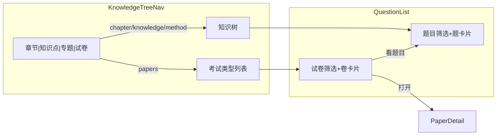

# 题库试卷视图开发计划

## 目标与范围

在现有题库页内完成「题目 / 试卷」双对象浏览，入口固定在 [KnowledgeTreeNav.vue](frontend/src/components/KnowledgeTreeNav.vue) 第三行 Tab（章节 / 知识点 / 题型专题 / **试卷**）。选中试卷后，右侧 [QuestionList.vue](frontend/src/views/QuestionList.vue) 整区切换：筛选改为参考图 3 的行选，列表改为参考图 4 的试卷横条。

**本轮包含**

- 试卷列表检索（年级 / 年份 / 类型 / 地区 + 关键词）
- 左侧考试类型导航
- 行卡片操作：打开、看题目；补录做可跳转的浅接入
- 只读试卷详情页（修复题目来源死链 `/papers/:id`）

**本轮不做**

- 独立一级导航「试卷」
- 整卷难度、浏览量、下载 / 分析 / 收藏
- 试卷空间隔离（当前 `GET /papers` 无 `space_id`，与题目不同；不在本轮改表）
- 练习 / 其他类资料（不建卷，只出现在题目三 Tab）

---

## 现状与缺口

| 能力       | 现状                                                                                             | 本轮要补                                                  |
| -------- | ---------------------------------------------------------------------------------------------- | ----------------------------------------------------- |
| 试卷列表 API | [list_papers](src/handlers/papers.rs) 已有 year/stage/semester/region/source_type/subject/status | 缺 `keyword`、`grade`、`sub_source_type`、`year_lt`（更早以前） |
| 前端 API   | [paperApi](frontend/src/api/client.ts) 仅 `listBrief` / `getQuestionPapers`                     | 补 `list` / `get`                                      |
| 题目反查卷    | `QuestionQuery` 无 `paper_id`                                                                   | 列表支持 `?paper_id=`                                     |
| 导航       | `TreeMode = chapter | knowledge | method`，切 Tab **不**刷新右列表                                     | 增加 `papers`，必须通知父组件换数据源                               |
| 路由       | 题目详情已链到 `/papers/:id`，路由不存在                                                                    | 新增详情页                                                 |
| 码表       | 试卷 kind 在 [questionSource.ts](frontend/src/utils/questionSource.ts)；录入可能写入中文 label             | 筛选同时匹配 code 与中文，避免筛不到                                 |

---

## 阶段 1：后端检索补齐

文件：[src/handlers/papers.rs](src/handlers/papers.rs)、[src/handlers/questions.rs](src/handlers/questions.rs)、[frontend/src/api/client.ts](frontend/src/api/client.ts)

`**PaperListQuery` 扩展**

- `keyword`：`title` / `school_name` `ILIKE`
- `grade`：精确匹配 `papers.grade`
- `sub_source_type`：精确匹配
- `year_lt`：`year < n`（UI「更早以前」→ `year_lt=2020`）
- `source_type`：保持；查询时用 `OR` 匹配 `source_type` 与 `sub_source_type`，并同时接受 kind code（`midterm`）与中文（`期中`）
- 继续用左侧学段/学科：已有 `stage` + `subject`（学科存的是「数学/物理」，与导航 `math/physics` 在 handler 里做映射）

`**GET /questions**`

- 增加 `paper_id`：`EXISTS (paper_questions WHERE question_id = q.id AND paper_id = ?)`，按 `display_order` 排序（有该参数时覆盖默认排序）

**前端 client**

- `PaperSummary` / `PaperDetail` 类型
- `paperApi.list(query)`、`paperApi.get(id)`
- `QuestionQuery.paper_id`

不改表结构。

---

## 阶段 2：左侧导航第四 Tab

文件：[frontend/src/components/KnowledgeTreeNav.vue](frontend/src/components/KnowledgeTreeNav.vue)

- `MODES` 增加 `{ key: 'papers', label: '试卷', kind: null }`
- 四个 Tab 在 260px 内容易挤爆：缩小 `.kt-mode-item` 的 `padding`/`font-size`，允许文案不换行；「题型专题」可显示为「专题」（`title` 仍为全称）
- 切到 `papers`：**不要** `loadTrees()`；下方改为考试类型列表（数据来自 `PAPER_KIND_OPTIONS` + 「全部试卷」）
- 新增 emit：`viewChange: ['questions' | 'papers']`、`sourceKindSelect: [kind | '']`
- 切回章节/知识点/专题：恢复树加载，并 `viewChange('questions')`
- 切 Tab 时清空类型/节点选中；学段/学科变化在试卷模式下同样 `contextChange`，供右列表带 `stage`/`subject`

左侧类型项与右侧筛选「类型」双向同步（父组件把当前 `sourceKind` 回传 `selectedSourceKind`，避免两套高亮打架）。

---

## 阶段 3：右侧试卷视图

文件：主改 [QuestionList.vue](frontend/src/views/QuestionList.vue)；新建小组件避免该文件继续膨胀：

- [frontend/src/views/papers/PaperFilterBar.vue](frontend/src/views/papers/PaperFilterBar.vue) — 图 3
- [frontend/src/views/papers/PaperRowCard.vue](frontend/src/views/papers/PaperRowCard.vue) — 图 4

**顶栏**

- 搜索 placeholder：`搜索试卷标题 / 学校`
- 状态下拉改为试卷状态：全部 / 草稿 / 已发布 / 已归档（`papers.status`）
- 隐藏题目批量审核、题型/难度相关控件、试题篮（试卷模式无意义）

**筛选条（图 3，纯文字行选，选中项蓝色）**

- 年级：随左侧学段变化。高中：`全部` + `高一上/下` … `高三上/下`（拆成 `grade` + `semester`）；初中：七年级～九年级 ± 学期
- 年份：全部、2026–2020、更早以前（字典复用 [paperFormOptions.ts](frontend/src/utils/paperFormOptions.ts) 的 `YEAR_OPTIONS`）
- 类型：全部 + `PAPER_KIND_OPTIONS`（与左侧列表同一码表）
- 地区：全部 + 省列表（`PROVINCE_OPTIONS` + 全国）；选省后出现市级 chips（`citiesForProvince`）
- **不放难度行**

**列表（图 4）**

- 左：类型色块（开学/阶段绿或蓝、高考真题深色、期中期末蓝）
- 中：标题；灰色 tags：年级、年份、地区、类型；题量、`updated_at`
- 右：`打开` / `补录` / `看题目`（不要浏览量、下载、收藏）
- 虚线分隔；空状态：「暂无已录入试卷」+ 引导去智能导入

**数据**

- `navView === 'papers'` 时 `fetchList` 走 `paperApi.list`，带上 stage/subject/status/filters
- URL 持久化：`/questions?view=papers`，刷新保持试卷视图

---

## 阶段 4：打开 / 看题目 / 补录 / 死链

**打开 → 试卷详情**

- 路由：`/papers/:id`，组件 [frontend/src/views/PaperDetail.vue](frontend/src/views/PaperDetail.vue)
- 调用已有 `GET /papers/{id}`：卷头元数据 + `paper_questions`（题号、题型、难度、分值、题干摘要）
- 操作：返回试卷列表、在题库中打开这些题、继续补录
- 本轮只读，不改卷信息

**看题目**

- 切回题目视图（导航 Tab 回到「章节」或保持 URL `view` 清空）
- `query.paper_id = 该卷 id`，列表仅该卷题目
- 顶栏可显示「来自试卷：{title}」可清除 chip

**补录（浅接入）**

- 跳转 `/questions/new?paperId={id}`
- 在 [QuestionEdit.vue](frontend/src/views/QuestionEdit.vue) 读取 `paperId`，写入 `paperIds`，并尽量 `paperApi.get` 预填来源条（有则填，失败不阻塞打开录入）
- 不在本轮做「自动打开原 document 继续 OCR」

**死链**

- [QuestionDetail.vue](frontend/src/views/QuestionDetail.vue) 已有 `:to="'/papers/' + s.id"`，详情页落地后即可用

---

## 交互约定

- 试卷 Tab 只列出 `source_category=paper` 语义的卷（后端即 `papers` 表；练习不建卷故不会出现）
- 左侧类型与筛选项「类型」是同一状态
- 从试卷「看题目」进入题目列表后，知识树恢复章节模式，**不要**在试卷 Tab 下混渲染题卡片
- 题目三 Tab 的现有筛选（来源 chips / 题型 / 难度 / 更多下拉）完全保留，用 `v-if` 切换模板，不改题目筛选交互

---

## 建议实现顺序

1. 后端 query 扩展 + `paperApi` 类型（可先用现有 `/papers` 打通列表）
2. Nav 第四 Tab + `viewChange` + 左侧类型列表（右列表可先空态）
3. PaperFilterBar + PaperRowCard + QuestionList 分支 fetch
4. PaperDetail + paper_id 反查 + 补录 query + 回归题目来源链接

验收：高中数学 → 试卷 → 筛「期中 + 2025 + 浙江」出对应卷；点看题目只出现该卷题；点打开进入详情；题目详情来源可点进同一详情；切回章节后题目筛选与知识树恢复原样。