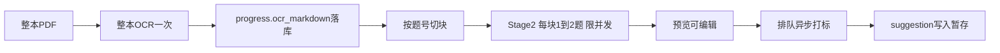

# 长 PDF 识别与打标改造计划

确认后先落文档 `[docs/长PDF识别与打标改造计划.md](docs/长PDF识别与打标改造计划.md)`（体例对齐 `[docs/异步补全机制_执行计划.md](docs/异步补全机制_执行计划.md)`），并在 `[docs/README.md](docs/README.md)` 加索引。本轮只写文档，不改业务代码。

## 现状与目标

当前 PDF 快路径（`[src/workers/ai_parse_worker.rs](src/workers/ai_parse_worker.rs)` `run_pdf_fast_path`）：

问题：OCR 本身适合长卷；6000 字切块 + `max_tokens=8192` 会在解析卷上超时/截断；每题同步打标且把六种解法全文送进 LLM，长卷再乘几十次调用。OCR Markdown 未落库，Stage2 重跑会整本再 OCR。

目标流水线：

## 阶段划分（文档中的实施顺序）

### 阶段一：OCR 只做一次（P0）

- 整本 OCR 成功后写入 `ai_parse_tasks.progress.ocr_markdown`（可加 `ocr_engine` / `ocr_chars`），不新增表。
- Worker 重入（僵尸恢复、Stage2 失败重试）若已有 `ocr_markdown` 则跳过 OCR。
- 改动点：`[src/workers/ai_parse_worker.rs](src/workers/ai_parse_worker.rs)` `run_pdf_fast_path` Phase 1/2；进度 JSON 读写处。
- 验收：杀进程后重跑同一任务不再打 OCR 引擎日志。

### 阶段二：按题号切块（P0，收益最大）

- 新增 `split_markdown_by_question_no`：识别行首 `16.` / `16、` / `（16）` / `(16)` 等；切点落在题号行，不按 `\n\n` 6000 字。
- 策略：普通卷每块最多 2 题；文件名/OCR 含「解析」或 `【解析】` 密度高 → **每块 1 题**。
- 切不出题号时回退现有 `[split_markdown_chunks](src/workers/ai_parse_worker.rs)`（`STAGE2_CHUNK_MAX_CHARS = 6000`）。
- 跨块半题仍走现有 Stage 3b `assemble_question_order`。
- Prompt：`[STAGE2_PARSE_SYSTEM_PROMPT](src/ai/prompt.rs)` 已有「按题号拆题」；补一句「本块只含所列题，不要补块外题」。
- 单测：题号切分、解析卷 1 题/块、无题号回退。
- 验收：高考解析卷不再整块 `ERR_LLM_TRUNCATED`；单题超时可重试该块。

### 阶段三：Stage2 限流与瘦身（P1）

- 切块循环改为信号量 **2** 路并发（保持心跳/取消）；超时仍单块重试 1 次。
- 解析卷可选第二遍：第一遍只要题干/题型/选项/答案；`analysis` 允许短摘录 + warning。完整解析不作为预览 blocker（用户可事后补）。
- 不在本阶段提高整卷 `max_tokens`；单块变小后 8192 足够。

### 阶段四：打标裁剪 + 异步（P1）

- `[tagging_content_from_parsed](src/ai/tagging/engine.rs)`：题干 + 选项 + 答案 + **解析前 500 字**，避免六法全文。
- 解析 Worker **不再同步** `run_tagging`。每题暂存后插入现有 `[ai_tagging_tasks](src/workers/ai_tagging_worker.rs)`（按 `input_hash` 幂等），`source_task_id` / `source_index` 已有。
- 暂存项 `matched`/`unmatched` 先空或 `tagging_status: pending`；打标完成回写 `progress.staged_questions[i]` 的 suggestion。
- 前端 `[AiRecognizeDialog.vue](frontend/src/views/edit/components/AiRecognizeDialog.vue)` / 任务进度：题目已出即可预览；标签显示「打标中」，完成后刷新，不挡确认保存。
- 约束与 `[docs/智能打标签统一改造.md](docs/智能打标签统一改造.md)` 一致：建议可预生成，题目与候选仍只在用户确认保存后入库。

### 阶段五：观测与前端文案（P2）

- 日志：OCR 跳过/切块题数/每块耗时/截断挽救/打标排队数。
- 截断提示保持「输出过长被截断」，不要再引导裁图。
- 前端 30 页限制（`[pdfToImages.ts](frontend/src/utils/pdfToImages.ts)`）仅作用于逐页图片回退；整本 PDF 直传不按页切图。若要放开页数，单独立项，本计划不改上限。

## 明确不做

- 按页拆 OCR（跨页大题/公式会断）。
- 为打标再 OCR 一遍。
- 20 页一次丢给 GLM 出整卷 JSON。
- 本计划不改计费配额数值（仍走现有 `ai_usage_log`）。

## 文档结构（将写入 docs 的章节）

1. 背景与现状问题（超时、截断、`partial_success`、同步打标）
2. 目标架构（mermaid）
3. 阶段一～五任务表（编号、文件、改动、验收）
4. 风险：题号识别误切、解析截断、打标延迟预览
5. 回滚：切块函数 feature 回退到 6000 字；打标可临时 `run_llm` 同步
6. 关联文档链接

