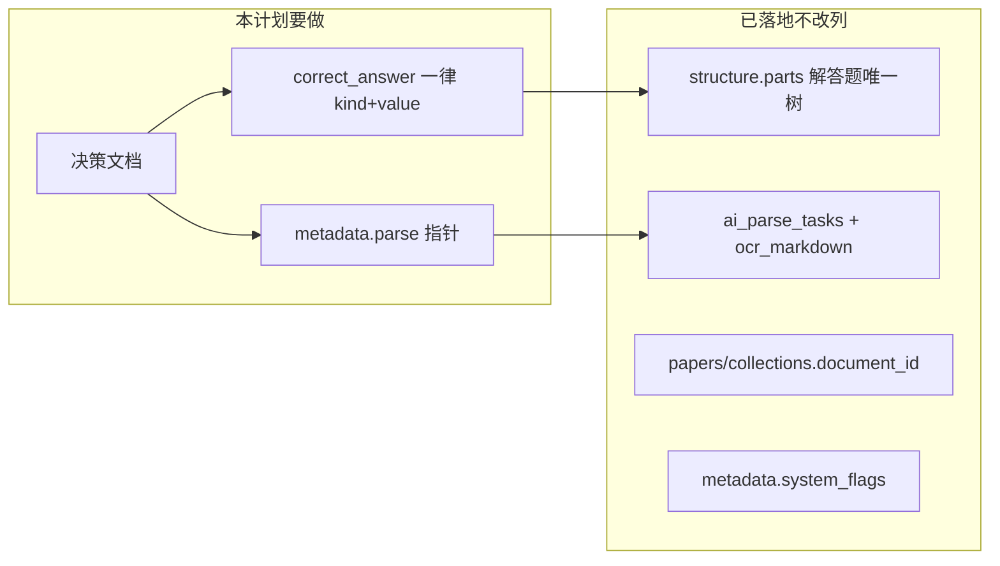

# 题目内容模型对齐：文档 + 真缺口落地

对照对象是 Desktop `[report.md](c:/Users/pikachu/Desktop/report.md)` 与现网 `[questions](src/models/question.rs)` / `[ai_parse_tasks](migrations/20260815000004_v211_ai_parse_tasks.sql)` / `[structure](migrations/20260830000001_question_structure.sql)`。**权威改写进仓库文档**；代码只修仍存在的双格式与「题目行上没有解析指针」。




## 明确不做

- 不加列：`parse_status`、`parse_confidence`、`parse_metadata`、`processing_metadata`、`source_document_id`、`raw_content`。
- 不把 `analysis` 改成解答题 JSONB；不把 `structure` 改成 `{nodes:[]}`；不用 `type` 替换 `kind`。
- 不新建 `parse_jobs` / `parse_attempts` / `parse_feedback`（任务表已是 `ai_parse_tasks`；闭环数据走 `[docs/全自动解析质量评估_闭环可行性.md](docs/全自动解析质量评估_闭环可行性.md)` 的 dump / `gold.json`）。
- 不迁移 `choice`/`multiple` 枚举名。
- 不把评测脚本 P0（`--reuse` 重跑 OCR 等）并进本计划；那份工作仍以闭环可行性文档为准。
- 不改 Desktop `report.md`（不在 git 内）。仓库文档生效后，那份报告视为过期草案。

`[docs/requirements.md](docs/requirements.md)` 仍写 `difficulty` 枚举、`judgment`、`correct_answer: "A"`，**只在索引里标明过期并指向新决策文**，不在本计划全文重写需求书。

---

## 阶段 0：决策文档（实现前先写清）

新增 `[docs/题目内容模型与解析溯源.md](docs/题目内容模型与解析溯源.md)`，并在 `[docs/README.md](docs/README.md)` 加一条索引。文档固定下列事实，避免再按 report 加列：


| 职责                 | 现网位置                                                                                                  |
| ------------------ | ----------------------------------------------------------------------------------------------------- |
| 解答题多问多解            | `structure = {version, parts[]}`；叶子 `answer` / `analyses[]`；`analysis` 与 `correct_answer` 为 JSON null |
| 选择/填空解析            | `analysis TEXT`；多解约定 `\n\n---\n\n`（本轮不改列类型）                                                           |
| 答案规范               | `{kind, value}`：choice→`options`，fill→`blanks`；多选是 `question_type=multiple`，**kind 仍为 choice**        |
| 业务态 vs 解析态 vs 内容缺口 | `questions.status` / `ai_parse_tasks.status` / `metadata.system_flags`                                |
| 资料溯源               | `documents` → `papers`/`question_collections`.document_id → 关联表；OCR 在 `progress.ocr_markdown`         |
| 编辑版本 vs 解析版本       | `question_versions` 是人工快照；pipeline/prompt 版本只在任务或评测 `meta.json`                                       |
| `parent_id`        | 遗留复合题多行；解答题禁止再拆行                                                                                      |


文末用「对照 report.md」表列出：哪条已落地、哪条 key 名写错、哪条改放到任务/评测文件。

---

## 阶段 1：`correct_answer` 收敛（真 P0）

现状：AI / Prompt 已是 `{kind,value}`（见 `[src/ai/types.rs](src/ai/types.rs)` `ParsedAnswer`、`[src/handlers/ai.rs](src/handlers/ai.rs)` `normalize_correct_answer`）；编辑保存仍写裸数组（`[QuestionEdit.vue](frontend/src/views/QuestionEdit.vue)` `buildPayloadFromSource` 约 1848–1861 行）。`is_answer_empty` 看不到 `value` 时把 `[]` 当成「有答案」。详情页 `isCorrect` / `isMultiChoice` 只认数组。

**规范（写入决策文 + 代码）：**

- 选择/多选落库：`{"kind":"choice","value":{"options":["A"]}}`（多选多个字母，kind 不变）。
- 填空落库：`{"kind":"fill","value":{"blanks":[{"position":1,"answer":"..."}]}}`。
- 解答题：继续 `null`，答案只在 `structure` 叶子。
- 入站兼容：`["A"]`、`"A"`、`{position,answer}[]`、缺 `kind` 的对象 → 规范化后再写库。出站只给规范形。

**后端**（建议集中函数，create/update 共用，放在 `[src/models/question.rs](src/models/question.rs)` 或 `src/util/normalize.rs`）：

- `canonicalize_correct_answer(question_type, raw) -> Option<Value>`。
- 修正 `is_answer_empty`：裸 `[]` / 空字符串视为空。
- 解答题路径保持现有 `persist_answer = None`。
- 存量：一次性 SQL 或管理脚本，把选择数组、填空 `{position,answer}` 数组改成 `kind/value`（可放 `migrations/` 数据回填，失败则跳过畸形行并记日志）。不改列类型。

**前端：**

- `buildPayloadFromSource` 写 `kind/value`，解答题仍 `correct_answer: null` + `structure`。
- 编辑回填：同时认数组与 `{kind,value}`（现在 2727 行只认数组，规范形会丢答案）。
- `[QuestionDetail.vue](frontend/src/views/QuestionDetail.vue)` 的 `isCorrect` / `isMultiChoice` 改走已有 `[extractChoiceLetters](frontend/src/utils/choiceAnswer.ts)`（它已能拆 `value.options`）。
- 列表/试卷预览同样路径扫一遍，避免只改编辑页。

**测试：** create/update 各题型各一种旧格式 → 库内为规范 JSON；空 `[]` → `pending_answer`；解答题仍为 null。前端以现有工具函数单测或组件关键路径为准，不扩范围做全站 E2E。

---

## 阶段 2：解析指针（不加列）

保存时若带 `ai_meta`（`[AiCreateMeta](src/models/question.rs)` 的 `task_id` + `staged_index`），在 `refresh_system_flags` 之后写入：

```json
"parse": {
  "task_id": "...",
  "staged_index": "p1_i0",
  "saved_at": "..."
}
```

只追加指针，不覆盖用户已有 `metadata` 业务字段。文档/试卷关系继续走 `link_to_container` + `paper_questions`，**不**在题目上写 `source_document_id`。

置信度、切块偏移、prompt hash **不**抄到题目行（人工一改即过期）。若暂存项上已有 chunk 范围，可原样留在 `progress.staged_questions[]`，题目只靠 `staged_index` 反查。任务 GC 后指针允许悬空，文档里写明。

本阶段不强制做「从题目跳回 PDF」UI；有指针即可供评测/重解析后续用。

---

## 阶段 3：政策收口（小改动）

- 创建/更新：`question_type=solution` 且 `parent_id` 非空 → 400，提示小问只进 `structure`。复制题目（`[spaces.rs](src/handlers/spaces.rs)`）若源行是历史复合子题，保持原样复制，不强制拆。
- 决策文写清选择/填空 `analysis` 的 `---` 约定；**本轮不改 TEXT 列**。若以后要结构化多解，只动这两类，且不得与解答题 `parts[].analyses` 再双写。

---

## 阶段 4：与评测闭环的边界（本计划只对齐文档）

report 文末的 `parse_attempts` / `parse_feedback` 对应的是评测文件，不是新表。在决策文里用一小节链到闭环可行性：题目表不存 gold；dump 保留 `paper.md` / `full.json` / `chunks` / `meta`（引擎、prompt hash、task_id）。**本计划不改** `[scripts/bench_eval_quality.py](scripts/bench_eval_quality.py)` 的规则分 P0。

---

## 建议落地顺序与验收

1. 决策文档 + README 索引（评审用，无行为变化）。
2. 后端 canonicalize + `is_answer_empty` + 存量回填 + API 测试。
3. 前端保存/回填/详情高亮。
4. `metadata.parse` 写入（有 `ai_meta` 的创建路径）。
5. 解答题拒绝 `parent_id`。

验收：新保存的选择/填空在库中为 `{kind,value}`；空数组会打 `pending_answer`；解答题仍无顶层答案；AI 保存行能看到 `metadata.parse.task_id`；`\d questions` 列集合与现在一致。