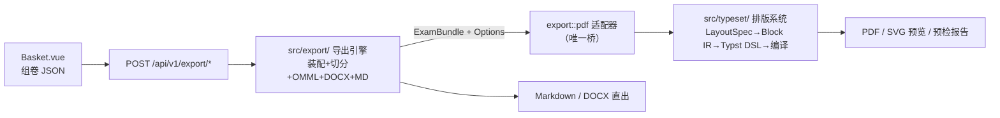

# 导出与排版系统

> **项目**：协同题库系统 (mathsets)
> **技术栈**：Rust + Axum 0.8 + Typst 0.15 · Vue 3 + Vite + Element Plus
> **分支**：`feat/export-and-typesetting`
> **最后更新**：2026-09-03

---

## 一、系统概述

导出与排版系统为试题篮提供三格式文件导出与实时预览能力：

| 格式 | 能力 | 出口 |
| --- | --- | --- |
| **PDF** | 印刷级排版（Typst 内核）：字体全嵌入、A3 对折密封线、智能分栏、三输出模式、K100 纯黑 | `POST /export/pdf` |
| **Word (DOCX)** | 可编辑 OMML 原生公式（双击进公式编辑器）、图片嵌入、纸张/边距/分栏同步 | `POST /export/docx` |
| **Markdown** | 纯文本 + 可选 bundle zip（含本地图片） | `POST /export/markdown` |

教师在试题篮选题组卷后打开导出面板，选择格式、输出模式与版面参数，可实时预览 PDF 分页效果并下载成品文件。公式解析失败时安全降级为红色原文并给出警告，**不中断整卷导出**。

### 三种输出模式

| 模式 | 内容差异 |
| --- | --- |
| 学生练习 `student` | 仅题干与选项 + 答题留白（横线格/点阵/空白三种样式） |
| 教师讲义 `teacher` | 内嵌四色 Callout（考点/易错/点拨/思路）+ 答案解析 |
| 标准考卷 `exam` | 题干成卷 + 卷末答案汇总与全解全析 |

---

## 二、架构总览

### 两模块解耦 + 两层 IR



- **导出引擎**（`src/export/`）：把试题篮题目装配成 `ExamBundle` IR（内容与语义层），输出 Markdown 与 DOCX；PDF 委托排版系统。
- **排版系统**（`src/typeset/`）：接收 `LayoutDoc`/`LayoutBlock` IR（排版域，带 `breakable` / `keep_with_next` 元数据），生成 Typst DSL 源码并编译为 PDF/SVG。
- **唯一桥接**：`export::pdf` 适配器（`src/export/pdf.rs`）把 `ExamBundle` 映射为 `LayoutDoc`，是两模块之间的唯一接口。Word/Markdown 完全不经过排版系统。

### 仓库目录结构

```
src/
├── export/                      # 模块 A：导出引擎
│   ├── mod.rs                   # 模块导出
│   ├── model.rs                 # ExamBundle/ExamSection/ExamQuestion/InlineNode IR
│   ├── assembler.rs             # 批量取题+权限过滤+选项解析+问树展开+Callout 派生
│   ├── content.rs               # stem 文本→InlineNode 切分（公式/图片/img-row/表格）
│   ├── assets.rs                # 图片抓取（本地映射 + 外链 reqwest）
│   ├── math/mod.rs              # latex2mathml 封装（输入归一）
│   ├── math/omml.rs             # MathML→OMML 递归下降转换器
│   ├── docx/mod.rs              # OOXML 打包（document/styles/settings/rels/媒体）
│   ├── docx/writer.rs           # DOCX writer 全量（卷头/题号/选项栅格/OMML/图片）
│   ├── markdown.rs              # Markdown 生成器 + bundle zip
│   └── pdf.rs                   # ExamBundle→LayoutDoc 适配器（唯一桥）
├── typeset/                     # 模块 B：排版系统
│   ├── mod.rs                   # 模块导出 + compile_pdf/compile_svg_pages 入口
│   ├── spec.rs                  # LayoutSpec 参数模型与内置预设（profiles）
│   ├── ir.rs                    # LayoutDoc/LayoutBlock（breakable/keep_with_next 元数据）
│   ├── blocks/mod.rs            # 题型模板注册表（QuestionKind→BlockBuilder trait）
│   ├── blocks/choice_grid.rs    # 选项估宽决策表（1×4/2×2/4×1，docx 共用）
│   ├── blocks/figure_float.rs   # 左文右图混排
│   ├── blocks/blank.rs          # 答题留白（横线格/点阵/高度）
│   ├── typst_gen.rs             # IR→Typst DSL（母版/密封线/页眉页脚/Callout 函数库）
│   ├── compiler.rs              # typst::World 实现 + PDF/SVG 编译 + comemo 缓存治理
│   └── preflight.rs             # DPI 校验/溢流/字体缺失汇总 Vec<Issue>
├── handlers/export.rs           # /export/{markdown|docx|pdf} 三端点
├── handlers/typeset.rs          # /typeset/{profiles|preview}
└── lib.rs                       # pub mod export/typeset + 路由注册

frontend/src/
├── api/client.ts                # exportApi/typesetApi（blob 下载+警告头解析）
├── api/types/exam.ts            # ts-rs 自动生成（ExamRequest/Issue/…）
├── api/types/layout.ts          # ts-rs 自动生成（LayoutSpec/PreviewResponse/…）
├── components/ExportDialog.vue  # 导出面板（格式/模式/版面参数/预览联动）
├── components/TypesetPreview.vue# SVG 分页实时预览（debounce 300ms+预检面板）
├── components/PreflightList.vue # 预检/回执共用清单组件
├── utils/svgSanitize.ts         # SVG 注入防御（B7）
└── views/Basket.vue             # 挂 ExportDialog 替换 window.print() 占位
```

---

## 三、API 契约

所有端点挂载在 `/api/v1` 下，需 JWT 认证（`Authorization: Bearer <token>`）。

### 3.1 请求体 `ExamRequest`（三格式共用）

```typescript
interface ExamRequest {
  title: string
  subtitle?: string
  exam_meta: {
    school?: string
    duration?: number        // 分钟
    total_score?: number
    instructions?: string[]  // 考生须知
  }
  mode: 'student' | 'teacher' | 'exam'
  sections: Array<{
    title: string            // 如 "一、单选题"
    instruction?: string
    questions: Array<{ id: string; default_score?: number }>
  }>
  options: {
    include_answer?: boolean
    include_analysis?: boolean
    answer_at_end?: boolean
    callouts?: { knowledge?: boolean; error_prone?: boolean; analysis?: boolean }
    answer_space?: { style?: 'lines' | 'dots' | 'blank'; height_cm?: number }
  }
  spec?: LayoutSpec           // 缺省时按 mode 取内置预设；带了就整体替换
}
```

> `sections` 由前端 `groupedSections` + `displayNoMap` 序列化，保留用户排序选择——导出结果与试题篮页面所见一致。

### 3.2 端点一览

| 方法 | 路径 | 响应 | 说明 |
| --- | --- | --- | --- |
| `POST` | `/export/markdown` | `text/markdown`；`?bundle=true` 时 `application/zip` | Markdown 直出，bundle 包含 `images/` 目录 |
| `POST` | `/export/docx` | `application/vnd.openxmlformats-officedocument.wordprocessingml.document` | OMML 可编辑公式 + 图片嵌入 |
| `POST` | `/export/pdf` | `application/pdf` | 经 Typst 排版引擎编译，按 `mode` 取默认 `spec`，请求带 `spec` 则整体覆盖 |
| `GET` | `/typeset/profiles` | `JSON: ProfilePreset[]` | 4 套内置版面预设（含完整 `LayoutSpec`） |
| `POST` | `/typeset/preview` | `JSON: PreviewResponse` | 逐页 SVG 预览 + 印前预检（`issues` + `warnings`） |

### 3.3 响应规格

- **文件类响应**（三格式）：
  - `Content-Disposition: attachment; filename*=UTF-8''<url-encoded-name>`（RFC 5987 中文文件名）
  - `X-Export-Warnings`：URL-encoded JSON `[{question_no, field, latex, reason}]`；超 ~8KB 截断并附 `truncated: true`
- **预览响应**（`PreviewResponse`）：
  ```typescript
  interface PreviewResponse {
    pages: string[]      // 逐页 SVG 源码（字形已描边，自包含）
    page_count: number
    issues: Issue[]      // 生成期+印前预检
    warnings: string[]   // typst 原始告警
  }
  ```
- **预检项**（`Issue`）：
  ```typescript
  interface Issue {
    severity: 'error' | 'warning' | 'info'
    field: 'formula' | 'image' | 'structure' | 'font' | 'layout'
    question_no?: number
    reason: string
    page?: number        // 1-based 物理页码；生成期问题为 undefined
  }
  ```

### 3.4 端点职责唯一化（R1 裁决）

实施计划正文原设计了 `POST /typeset/render` 作为独立的 PDF 渲染出口。经评审裁决（R1），**该端点未创建**：PDF 出口唯一收口为 `/export/pdf`，通过可选的 `spec` 字段控制版面。预览返回 SVG 不产 PDF，不违反「第二条 PDF 流水线」禁令。

---

## 四、版面参数模型 `LayoutSpec`

### 4.1 完整字段

```typescript
interface LayoutSpec {
  paper: 'a4' | 'a3_fold' | 'a3_tri'
  columns: 1 | 2 | 3
  margins: {
    top_mm: number; right_mm: number; bottom_mm: number; left_mm: number
    gutter_mm: number  // 栏间距
  }
  binding?: {
    position: 'left' | 'center_fold'
    areas: { school: boolean; class_name: boolean; name: boolean; exam_no: boolean }
  }
  header_footer: {
    header_title: boolean   // 动态页眉显示当前大题名
    page_number: boolean    // 页脚页码
    odd_even_outer: boolean // 奇偶页外侧对齐
  }
  profile: 'student' | 'teacher' | 'exam'
  fonts: { body: string; heading: string; math: string }
  answer_blank: { style: 'lines' | 'dots' | 'blank'; height_mm: number }
  color: 'rich' | 'print_black_only'
}
```

### 4.2 内置预设

| 预设 ID | 标签 | 纸张 | 栏数 | 装订 | 适用模式 |
| --- | --- | --- | --- | --- | --- |
| `a4_lecture` | A4 讲义 · 单栏 | A4 | 1 | 无 | teacher |
| `a4_practice` | A4 练习 · 双栏 | A4 | 2 | 无 | student |
| `a3_fold_exam` | A3 对折 · 双栏考卷 | A3 对折 | 2 | 中缝对折 | exam |
| `a3_tri_exam` | A3 三栏考卷 | A3 三栏 | 3 | 左侧装订带 | exam |

预设通过 `GET /typeset/profiles` 获取，前端下拉选中后整体替换本地 `spec` 副本（断引用的深拷贝），后续微调在副本上操作，回传时整体覆盖。

### 4.3 `resolve_spec` 覆盖语义

```
请求无 spec → 按 mode 取默认预设的 spec
请求带 spec → 整体替换（T3.3 口径），不做字段级合并
```

PDF 与 Word 共用同一个 `resolve_spec`（`src/export/pdf.rs`），字段级覆盖语义两边一致。

---

## 五、前端使用指南

### 5.1 ExportDialog

- **默认格式**：PDF（首次打开即拉取预设清单）
- **格式切换**：`pickFormat()` 在非 PDF 时自动关闭预览开关
- **版面参数联动**：
  - PDF 与 Word 共用同一份 `LayoutSpec` 副本
  - 修改边距/栏数/装订/留白样式会触发 300ms debounce 重排预览
  - Markdown 不产出 `spec` 字段（无版面概念）
- **装订带备忘录**：关闭装订线时将当前配置存入 `bindingMemo`，重新打开时回填
- **参数夹取**：边距 5–40mm、栏间距 0–40mm、留白高度 2–20cm（步长 0.5），后端不校验

### 5.2 TypesetPreview

- **只对 PDF 开**：Word 走 OMML + Word 自己的分页，Markdown 无版面
- **只挂当前页**：DOM 中恒为一张 SVG，翻页不发新请求
- **换参数不清屏**：失败时保留上一帧，状态条转红并提供「重试」
- **SVG 注入防御**（B7）：DOMParser 解析后剥 `<script>` / `<foreignObject>` / 全部 `on*` 属性 / `javascript:` 链接；解析失败整页不注入（fail-closed）
- **缩放**：100% = 实际尺寸（1pt = 96/72 px），适应宽度铺满容器

### 5.3 PreflightList

预检与导出回执共用的清单组件：
- 预览开着 → 显示 `issues`（超集，带 severity + page）
- 没开预览 → 显示导出回执（`ExportWarning` 归一为 `Issue`，无级别/页码，标注"无页可定位"）
- 有 `page` 的条目点击可跳转到对应预览页
- 无 `page` 的条目（生成期问题）按钮 disabled，title 写 "排版之前，无页可定位"

---

## 六、开发者扩展指南

### 6.1 新增题型

1. 实现 `BlockBuilder` trait（`src/typeset/blocks/mod.rs`）：

```rust
pub trait BlockBuilder {
    /// 本 builder 负责的题型
    fn kinds(&self) -> &'static [QuestionKind];
    /// 分页与留白策略
    fn policy(&self) -> Policy { Policy::default() }
    /// 出块：默认实现按 Policy 走通用序列
    fn build(&self, q: &ExamQuestion, ctx: &BlockCtx, split: &Splitter) -> Vec<LayoutBlock> {
        // ... 默认实现
    }
}
```

2. 注册到 `Registry`：

```rust
// src/typeset/blocks/mod.rs
impl Registry {
    pub fn standard() -> Self {
        Self::new()
            .register(&ChoiceBuilder)
            .register(&MultipleChoiceBuilder)
            .register(&FillBuilder)
            .register(&SolutionBuilder)
            .register(&CompositeBuilder)
            .register(&YourNewBuilder)  // ← 新增
    }
}
```

> 同一题型后注册者胜出（`.rev()` 查找）。新增假想题型仅需注册即可出块，无需修改排版主循环。

### 6.2 新增版面预设

在 `src/typeset/spec.rs` 的 `presets()` 函数中追加 `ProfilePreset`：

```rust
ProfilePreset {
    id: "your_preset_id".into(),
    label: "自定义名称".into(),
    spec: LayoutSpec {
        paper: Paper::A4,
        columns: 2,
        margins: Margins { top_mm: 20.0, /* ... */ },
        // ... 完整字段
    },
}
```

前端会自动通过 `GET /typeset/profiles` 拉到新预设，无需前端改动。

### 6.3 新增 Callout 类型

1. 在 `src/export/model.rs` 的 `CalloutKind` 枚举中追加变体
2. 在 `src/typeset/typst_gen.rs` 的 `callout_colors()` 中添加色板（`bar` + `bg`）
3. 在 `src/export/assembler.rs` 中添加从题目数据到 `Callout` 的派生规则
4. K100 纯黑模式下的回退已自动处理（`callout_colors` 对所有 kind 统一返回 `luma(0%)` / `luma(100%)`）

现有四种 Callout 色板：

| 类型 | 色条 | 底色 |
| --- | --- | --- |
| Knowledge（考点） | `#1F4E79` | `#EAF1F8` |
| ErrorProne（易错） | `#B00000` | `#FCECEA` |
| Tip（点拨） | `#2E7D32` | `#EAF6EC` |
| Approach（思路） | `#B26A00` | `#FFF5E6` |

---

## 七、方案调整归档

以下为实施过程中因实测结果而调整的方案，均已在实施计划 §十五 与开发日记中详细记录。

### R1：端点职责唯一化

原计划设计了 `POST /typeset/render` 作为独立 PDF 渲染出口。裁决不创建该端点：PDF 出口唯一化为 `/export/pdf`（mode 默认 spec + 请求 `spec` 覆盖），预览出口为 `/typeset/preview`（返回 SVG，不产 PDF）。

### R12：印前预检判据

原计划通过收集 Typst 编译诊断逐题定位。实测 Typst 对文字/表格溢出纸面完全不报 warning（宁可画到纸外也不报错），且编译诊断不带源码行号。实际实现改为**直接回读编译后的帧树几何坐标**：

- **溢流检测**：`PlacedRun.w_mm`（排版宽度）+ 锚点坐标与 `page.frame.size()` 纸边比较
- **有效 DPI**：帧树印出宽度 + 文件头像素尺寸，比值 < 300 → Warning
- **字体回退**：段落含汉字而 `family` 不在 `CJK_FAMILIES` → 回退字体警告

只判纸边不判版心（页眉页脚、装订带在页边距里画图）。

### R13：编译缓存

原计划在 `compiler.rs` 实现应用级请求 LRU（`hash(请求体) → 产物`）。实测确认 Typst 底层 `comemo` 库已自带以输入源为键的整文档增量缓存（同参二次请求 3–16ms）。实际实现改为**基于 `comemo::evict(COMEMO_KEEP = 3)` 进行进程级缓存容量上界治理**，不再额外封装一层哈希缓存。

### R14：Issue 结构调整

原计划 `Issue` 不含 `page` 字段（R12 判定牵动面过大）。因 T5.5 的"预检项点击定位"需要机器可读的页码，最终给 `Issue` 增加了 `page: Option<u32>`（1-based 物理页码）。生成期问题（装配/素材/公式降级）发生在编译前，`page` 恒为 `None`，前端面板标注"排版之前，无页可定位"。

### 性能基准（T5.4 裁决）

原计划门槛：20 题冷编译 ≤500ms，100 页冷编译 ≤2s。裁决后重述：

| 档位 | 指标 | 实测 | 判定 |
| --- | --- | --- | --- |
| 20 题短选项卷 | ≤500ms | 435ms | ✓ |
| 20 题混合卷 | ≤700ms 回归哨兵 | 648–674ms | ✓（超原 500ms 是保留贴阈值复量的代价，裁决不换） |
| ≤80 页 | ≤2s | 1927ms | ✓ |
| 百页冷编 | 已知不达标项 | 2524ms | 百页走热请求（99ms） |
| 热请求 | 毫秒级 | 3–16ms（comemo 命中） | ✓ |

---

## 八、已知边界与限制

### 格式间差异

1. **Word 不支持的 PDF 排版特性**：中缝对折密封线（退化为栏间距）、竖排考生信息（退化为首页横排表）、答题留白样式（横线格/点阵）、动态页眉、K100 纯黑模式
2. **A3 逻辑页码差异**：PDF 侧 A3 对折一张纸 = 2 逻辑页；Word 侧按物理张数计
3. **公式交叉引用未产出**：块级公式仅生成编号（如 `(1.1)`），因源 Markdown 无 label 语法，不实现 `@ref`

### 排版内核

4. **估宽口径差**：`export/pdf.rs` 的 `HANGING_EM = 2.0` 与 `typst_gen.rs` 的 `HANG_EM = 2.6` 存在 0.6em 差距。估宽偏乐观时由 R7 的 `measure()` 兜底运行时降列，不影响排版正确性
5. **复杂选项单元格收缩**：包含图片/表格/硬换行/块级公式的选项（`boxed: false` 分支）走 Typst `grid` 渲染时会收缩为内容宽度而非等宽铺满（follow-up #38）
6. **预览 SVG 不可选中**：字形已描边（self-contained），无 `<text>` 节点可搜索/选中
7. **百页冷编 2.5s**：瓶颈为 Typst 逐字 CJK shaping（400 题 × 6.4ms + 页家具），在不改内容量前提下不可达原 2s 门槛

### 运维

8. **字体依赖**：思源宋体/黑体 SC 4 个 OTF 文件经 git-lfs 管理（`assets/fonts/`），克隆后需 `git lfs pull`；缺失时 `scripts/check_fonts.{ps1,sh,bat}` 会拦截
9. **ts-rs 绑定生成**：改完 Rust 类型必须跑全量 `cargo test --lib` 以重生成 `frontend/src/api/types/` 下的 TS 文件；跑子集会用子集覆盖全量
10. **comemo 缓存**：`COMEMO_KEEP = 3` 是经验值（三模式来回切），进程全局共享，高并发下有效容量比 3 小

---

## 九、测试覆盖

| 层 | 覆盖范围 | 位置 |
| --- | --- | --- |
| Rust 单测 | 切分器 / 装配器 / 估宽决策表 / OMML 黄金快照 / 映射与适配 / typst_gen 结构断言 / World 编译 / 预检 / comemo 命中 | `cargo test --lib`（722+ passed） |
| Rust 集成 | 三格式端点 / profiles / preview / 权限 / 警告头 | `cargo test --test export_*` / `--test typeset_*` |
| 前端 | `vue-tsc -b && vite build`，类型由 ts-rs 生成不手写 | `npm run build` |
| 手工验收 | §十 清单 1-6（见实施计划） | 逐项验收记录在 walkthrough |

### 性能基准测试

```bash
# 三档冷/热读数（--release 下运行）
cargo test --lib benchmark_three_tiers -- --ignored

# comemo 命中断言
cargo test --lib hot_path_hits_comemo -- --ignored

# 选项渲染成本对比
cargo test --lib cost_of_the_measure_fallback -- --ignored
```
