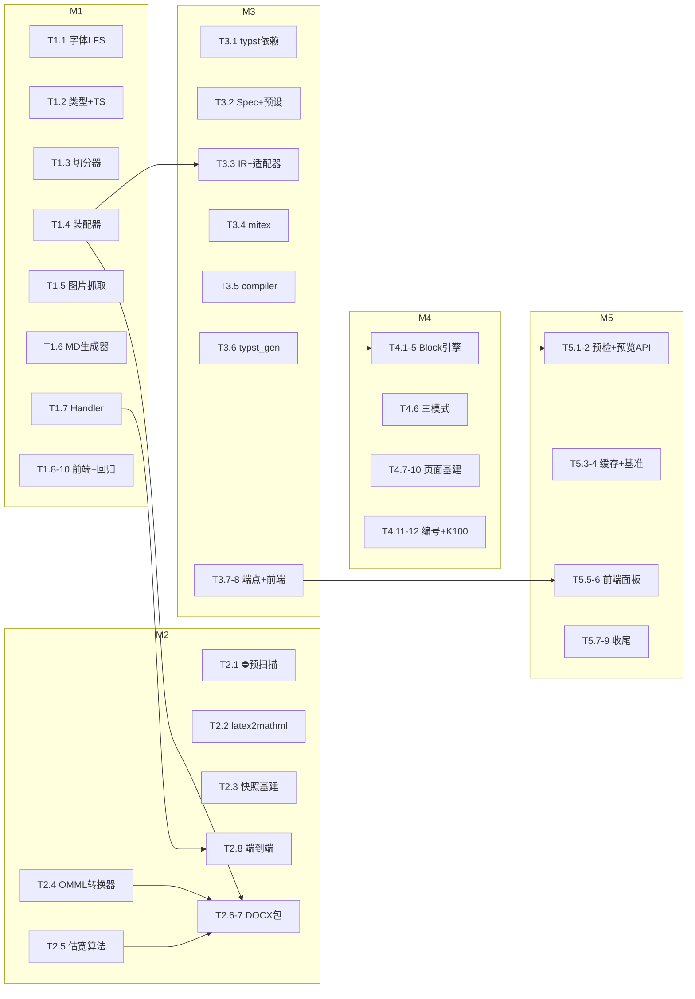

# 导出引擎与排版系统 开发任务分解（M1–M5）

> 基准：[导出引擎与排版系统_实施计划.md](./导出引擎与排版系统_实施计划.md)（正文 §一～§十四 + **§十五 v1.2 评审修订**）。
> 本文档把五个里程碑细化为**任务级工作包**：每个任务标注产出文件、依赖、完成标准（DoD）与测试；§十五 的修订点（R1-R7 / B1-B8 / P1-P4）已内化到对应任务并以标签引用。
> 分支：`feat/export-and-typesetting`（当前分支，直接分批提交）。

---

## 〇、总体约定

- **任务编号**：`{里程碑}-{序号}`（如 T2.4）。任务是最小验收单元，完成后立即提交。
- **提交规范**：沿用仓库惯例 conventional commits，scope 取 `export` / `typeset` / `frontend` / `docs` / `chore`（如 `feat(export): 数学公式 MathML→OMML 转换器与黄金快照测试`）。一个任务一个提交；紧耦合小任务（≤2）可合并。
- **测试准入**：每个后端任务合入前 `cargo test` 相关模块全绿；每个前端任务合入前 `npm run build` 通过。
- **风险门**：标注 ⛔ 的任务是决策门——结果不满足出口条件时**先停下评审**，不得带病推进。

| 里程碑 | 任务数 | 估算（人日） | 出口条件（里程碑级 DoD） |
| --- | --- | --- | --- |
| M1 基础设施 + Markdown 端到端 | 10 | 4-6 | 试题篮 → 导出面板 → 下载 .md（含 bundle zip）；警告条工作；字体 LFS 就绪 |
| M2 OMML + DOCX 端到端 | 8 | 5-8 | docx 可下载；Word/WPS 双击公式可编辑；黄金快照全绿；预扫描报告产出 |
| M3 排版内核 + PDF 基础版 | 8 | 4-6 | 三格式全可用；A4 单栏 PDF 可下载；中文无豆腐块 |
| M4 Block 引擎 + 页面基建全量 | 12 | 5-7 | 考卷级 PDF：A3 对折密封线 / 三模式 / 防跨页 / 留白 / 智能选项 |
| M5 预检 + 实时预览 + 收尾 | 9 | 3-5 | 预览面板实时刷新；预检报告；性能基准达标；文档交付 |

**合计约 21-32 人日。**

任务依赖总览：

---

## 一、M1 基础设施 + Markdown 端到端

**目标**：搭好导出模块骨架与全部共享基建（类型 / 切分 / 装配 / 图片），以 Markdown 作为第一条打通的垂直切片；完成不可逆的字体 LFS 时序。

| ID | 任务 | 主要产出 | 依赖 | 完成标准（DoD） |
| --- | --- | --- | --- | --- |
| T1.1 | 字体 LFS 基建（§十三） | `.gitattributes`（LFS 规则**先落**）、`assets/fonts/` 思源宋体/黑体 SC 各 Regular/Bold 共 4 OTF（约 90-100MB，R6）、`scripts/check_fonts.{ps1,sh,bat}` | 无 | `git lfs ls-files` 列出 4 文件；三平台脚本对「缺失/pointer/正常」三种状态行为正确；模拟未装 LFS 的克隆能被拦截 |
| T1.2 | IR 类型与 TS 同步（B6） | `src/export/model.rs`（ExamRequest / ExamBundle / ExamSection / ExamQuestion / InlineNode / Callout / Issue）；引入 `ts-rs`；`frontend/src/api/types/exam.ts` | 无 | serde 与 ts-rs 双导出字段一致；`QuestionKind` 含 `Composite`（§7.4）；`cargo test export::model` 绿 |
| T1.3 | 内容切分器 | `src/export/content.rs` | T1.2 | 单测 ≥12 例：`$$`/`\[\]`/`$`/`\(\)` 四种定界符、`\$` 转义、`![]{width,align}`、`:::img-row`、管道表格、混合嵌套文本 |
| T1.4 | 装配器 | `src/export/assembler.rs`；`handlers/mod.rs`、`lib.rs` 注册模块与 `/export/markdown` 路由占位 | T1.2, T1.3 | 单测+DB 集成：批量取题 `ANY($1)`；可见性过滤（复用 `can_access_space`，§12.4）；选项解析回退（`parseOptions`/`extractOptionsFromStem` 移植，≥2 选项才生效）；问树展开；Callout 派生；填空挖空（B2：stem 已含 `______` 沿用，否则按 blanks 挖空）；连续题号重排；`added` 单分组形态兼容 |
| T1.5 | 图片抓取器（B1） | `src/export/assets.rs`：本地 `/uploads/**` → `upload_dir` 映射 + 外链 reqwest 拉取（超时 5s / 上限 10MB / `infer` 嗅探） | 无 | 单测：本地命中、外链成功、超时、超限、格式不符五条路径 |
| T1.6 | Markdown 生成器 | `src/export/markdown.rs` | T1.3, T1.4, T1.5 | 快照单测：frontmatter / 大题统计 / 公式原样保留 / 文本最小转义（`*_` `` ` `` `#`）/ 模式开关组合（内嵌 vs 卷末）/ Callout `> [!NOTE]`；`bundle=true` zip（md + images/，外链图片拉取后入包） |
| T1.7 | Handler 与警告通道 | `handlers/export.rs` 实现、`lib.rs` 生效路由 | T1.6 | oneshot 集成：200 + `Content-Disposition` RFC 5987 中文名 + `X-Export-Warnings`（URL-encoded JSON，超 ~8KB 截断并附 `truncated:true`，B3）；复用 `db_err`（§12.3） |
| T1.8 | 前端 API 与类型 | `frontend/src/api/client.ts` 增 `exportApi`（blob、`timeout: 60000` B4、警告头解析含 truncated 提示） | T1.2 | `npm run build` 过；类型来自 T1.2 生成的 `exam.ts` |
| T1.9 | ExportDialog v1 + Basket 接入 | `components/ExportDialog.vue`（本期限 Markdown 可选，格式三选一控件先置灰其余）、`views/Basket.vue` 替换 `downloadPaper()` 的 `window.print()`（保留 print 兜底入口，`Basket.vue:325-332`） | T1.8 | 手工验收：三种排序模式（按题型 / 加入正序 / 倒序）下导出内容与页面所见一致；空篮 / 部分题目不可见时的警告条表现 |
| T1.10 | M1 回归 | — | 全部 | `cargo test` 全绿；`npm run build` 绿；本节手工清单执行并记录 |

**提交划分**：① chore: 字体 LFS 与校验脚本（T1.1）② feat(export): IR 类型与 TS 导出（T1.2）③ feat(export): 切分器与装配器（T1.3-1.5）④ feat(export): markdown 生成与导出端点（T1.6-1.7）⑤ feat(frontend): 导出面板首版接入（T1.8-1.9）。

---

## 二、M2 OMML + DOCX 端到端

**目标**：打通「LaTeX → MathML → OMML → 可编辑 Word 公式」核心链路，产出 DOCX 完整生成能力。

| ID | 任务 | 主要产出 | 依赖 | 完成标准（DoD） |
| --- | --- | --- | --- | --- |
| T2.1 ⛔ | latex2mathml 覆盖率预扫描（P1） | `src/bin/scan_latex.rs`（扫描全库 stem/analysis/选项中公式跑 latex2mathml，统计失败率并输出样例报告） | 无 | 产出报告；**降级率 ≤5% 通过**，>5% 停下评审备选（KaTeX `output:'mathml'` 预转换 / temml）并更新计划 |
| T2.2 | latex2mathml 封装 | `src/export/math/mod.rs`：输入归一（对齐前端 KaTeX 宏 `\emptyset→\varnothing`）+ 成功/失败枚举 | T2.1 过门 | 单测：常见式成功、非法串失败不 panic、宏归一生效 |
| T2.3 | XSL 快照基建（R2） | `.gitignore` 加 `assets/xsl/`；`scripts/gen_omml_snapshots.py`（lxml 执行官方 XSL → `tests/snapshots/*.omml` ≥15 组：分式/根号/上下标/∑∫∏ 上下限/矩阵/cases/括号/重音/中文 mtext/`linethickness=0`/非法输入）；`assets/xsl/README.md` 说明从本机 Office 目录拷贝 | T2.2 | 快照可在开发机一键再生成；仓库不含 XSL 本体，只含固件 |
| T2.4 | MathML→OMML 转换器 | `src/export/math/omml.rs`；Cargo 增 `roxmltree`（读）+ `quick-xml`（写）（R3） | T2.3 | **黄金快照对比全绿**（规范化三步：命名空间前缀统一 → 属性排序 → 空白归一）；§5.3 映射表全覆盖（含 `isNary`/`FStartOfRun`/`OutputText` 语义）；未知节点递归子节点+警告不 panic |
| T2.5 | 选项估宽算法 | `src/typeset/blocks/choice_grid.rs`（纯函数，无 typst 依赖，docx/typst 共用；R7 口径：按**渲染字形数**折算——剥命令名、宏参数计一次、上下标半宽） | 无 | 决策表单测：短（1×4）/ 中（2×2）/ 长（4×1）/ 含公式选项，按 25%/50% 阈值 |
| T2.6 | DOCX 打包器骨架 | `src/export/docx/mod.rs`：`[Content_Types].xml` / `_rels` / `document.xml` 骨架 / `styles.xml`（Normal 宋体+TNR 10.5pt、大题标题、题号、选项、Callout）/ `settings.xml`（`m:mathPr`）/ docProps | 无 | 最小 docx（一段文字+一个公式）被 Word 与 WPS 正常打开 |
| T2.7 | DOCX writer 全量 | `src/export/docx/writer.rs` | T2.4, T2.5, T2.6 | 卷头（试卷名/考试说明/分值汇总表/校班姓名考号信息表）；大题灰底标题；悬挂缩进题号；选项网格 `w:tbl`（1×4/2×2/4×1）；OMML 行内混排与 `m:oMathPara` 块级；`w:keepNext`+`w:keepLines` 防腰斩链；图片 `wp:inline`（EMU、`{width,align}`、14cm 上限、PNG/JPEG 直嵌、SVG 跳过+警告）；按模式内嵌/卷末答案；`sectPr` 页脚 `第 X 页 共 Y 页` 域。**⛔ R5 决策门：Word/WPS 实测 keepNext 与表格联动，失效则本任务内降级 `w:tabs` 制表位方案并记录** |
| T2.8 | `/export/docx` 端到端 | `handlers/export.rs` 扩展 | T2.7 | oneshot 集成测试；手工验收：双击公式进编辑器（OMML 可编辑）；解压 docx 数 `m:oMath` 与题数一致；含非法 LaTeX 题目整卷不中断、红色原文+警告头 |

**提交划分**：① chore(export): 预扫描工具与报告（T2.1）② feat(export): latex2mathml 封装与快照基建（T2.2-2.3）③ feat(export): OMML 转换器与黄金快照测试（T2.4）④ feat(export): 选项估宽算法（T2.5）⑤ feat(export): docx 打包与 writer（T2.6-2.7）⑥ feat(export): /export/docx 端到端（T2.8）。

---

## 三、M3 排版内核 + PDF 基础版

**目标**：typst 全家桶就位，LayoutSpec → LayoutDoc → Typst DSL → PDF 链路打通（A4 单栏基础版），三格式全部可用。

| ID | 任务 | 主要产出 | 依赖 | 完成标准（DoD） |
| --- | --- | --- | --- | --- |
| T3.1 | typst 依赖引入 | `Cargo.toml`：`typst` / `typst-pdf` / `typst-svg` / `typst-assets` / `mitex` / `comemo` / `ecow`（版本锁定并记录） | 无 | dev 与 release profile 各完整构建一次并记录耗时（P4）；无 Windows 原生依赖引入 |
| T3.2 | LayoutSpec + 预设 | `src/typeset/spec.rs`：§6.1 全字段 + 4 内置预设（A4讲义单栏/A4练习双栏/A3对折双栏考卷/A3三栏考卷）+ mode→默认 spec 映射 + 留白字段职责合并规则（B5：`options.answer_space` 管开关与高度、`spec.answer_blank.style` 管样式、冲突以 options 为准）；ts-rs 导出 `frontend/src/api/types/layout.ts` | 无 | 预设序列化快照单测；TS 类型再生成 |
| T3.3 | LayoutDoc IR + 适配器 | `src/typeset/ir.rs`（LayoutDoc/LayoutBlock，`breakable`/`keep_with_next` 元数据）、`src/export/pdf.rs`（ExamBundle→LayoutDoc 映射） | T1.4, T3.2 | 映射单测：选择/填空/解答（问树）/综合题、三模式、Callout、留白合并 |
| T3.4 | mitex 公式管线 | `src/typeset/math.rs`：LaTeX→Typst math（输入归一与 T2.2 一致）；失败降级红色原文等宽块 + Issue | T3.1 | 单测：分式/矩阵/上下标嵌套成功；非法输入降级且不中断 |
| T3.5 | 编译器 | `src/typeset/compiler.rs`：`World` 实现（虚拟 `main.typ`、`/uploads/**`→`upload_dir` 映射、**外链图片字节注入** B1、字体 = `typst-assets` + `assets/fonts/` **运行时读目录**（R6，禁 `include_bytes!`）、缺字体回退+告警 §13.4）；`compile_pdf` / `compile_svg_pages`；诊断收集 | T3.1 | 单测：hello-world 源编译出非空 PDF；含中文/图片/公式的源编译成功；诊断可枚举 |
| T3.6 | typst_gen 基础模板 | `src/typeset/typst_gen.rs`：`#set page/text(lang:"zh")/par(justify)` + 函数库 v1（`question-block` / `section-header` 灰底分值框 / 选项简化 1 列 / 卷头简化版）+ mitex 公式内嵌 + `image()` | T3.3, T3.4, T3.5 | 生成源码结构断言单测（母版/题块/函数调用存在）；20 题仿真卷编译出 PDF 且中文无豆腐块 |
| T3.7 | 端点：`/export/pdf` + `/typeset/profiles` | `handlers/export.rs`、`handlers/typeset.rs`、`lib.rs` | T3.6 | oneshot 集成；**R1：不创建 `/typeset/render`**，PDF 出口唯一化为 `/export/pdf`（mode 默认 spec + 请求 `spec` 覆盖）；profiles 返回预设 |
| T3.8 | 前端 PDF 选项解锁 | `ExportDialog.vue` PDF 展开区（预设下拉/纸张/栏数/密封线/留白样式，字段来自 `layout.ts`） | T3.2, T3.7 | 手工：选 PDF 导出 A4 单栏成功；spec 覆盖生效 |

**提交划分**：① chore(typeset): typst 依赖引入（T3.1）② feat(typeset): spec/预设与 TS 导出（T3.2）③ feat(typeset): LayoutDoc 与导出适配器（T3.3）④ feat(typeset): mitex 管线与编译器（T3.4-3.5）⑤ feat(typeset): typst_gen 基础模板与 PDF 端点（T3.6-3.7）⑥ feat(frontend): PDF 导出选项（T3.8）。

---

## 四、M4 Block 引擎 + 页面基建全量

**目标**：排版能力达到考卷级——Block 引擎全量、A3 对折密封线、母版分离、三输出模式完整。

| ID | 任务 | 主要产出 | 依赖 | 完成标准（DoD） |
| --- | --- | --- | --- | --- |
| T4.1 | 题型注册表 | `src/typeset/blocks/mod.rs`：`BlockBuilder` trait + choice/multiple/fill/solution/composite 五个 builder 注册 | T3.3 | 新增假想题型（如 prove）仅需注册即可出块的扩展性单测 |
| T4.2 | 智能选项栅格渲染 | typst_gen 接 `choice-grid`：Rust 决策（T2.5）→ `grid(columns:n)`；**R7 兜底：`context measure()` 实测溢出时运行时降列** | T2.5, T3.6 | 生成源码断言 + 编译后视觉检查：短选项 1×4、中 2×2、长 4×1 |
| T4.3 | 左文右图 | `src/typeset/blocks/figure_float.rs`：题干 `grid(columns:(1fr, 35%))` 绑定 | T4.1 | 含块级图题目编译正确，图列宽度恒定不失宽 |
| T4.4 | 答题留白 | `src/typeset/blocks/blank.rs`：高度/横线格/点阵三种样式；教师版折叠为解析 Callout | T4.1 | 三样式编译视觉正确；模式切换单测 |
| T4.5 | 防跨页 | 整题 `#block(breakable:false)`；解答题问树子块 + 小问标题 `keep with next` | T4.1 | 构造边界卷（题块恰跨页）验证选择/填空不腰斩、小问标题不孤立页脚 |
| T4.6 | 三模式完整 | 学生（题干+选项+留白）/ 讲义（内嵌四色 Callout：考点/易错/点拨/思路，`callout()` 函数）/ 考卷（卷末 `AnswerKeyItem` 答案汇总 + 全解全析） | T4.4, T4.5 | 三模式各出一份样卷，模式间内容差异符合 §四 options 开关语义 |
| T4.7 ⛔ | A3 对折 / 三栏 + 逻辑页码（R4） | typst_gen：A3 横向 `columns(2)`/`columns(3)`、中线折线；**自定义逻辑页计数器**（物理页 ×2）+ `place()` 左右栏 footer、奇偶外侧按逻辑页判定 | T4.5 | 双栏内容自然左→右流动；页码「第 X 页（共 Y 页）」按逻辑页计数；奇偶外侧对齐正确；**此门不过不进入 T4.8** |
| T4.8 | 密封线 | `sealing-line()`：rotate 90° 虚线 + 垂直「密封装订线，请勿折叠」+ 学校/班级/姓名/考号填涂区；`binding: Left | CenterFold` | T4.7 | A3 对折中线与 A4 左侧两种装订位视觉正确；文字垂直可读 |
| T4.9 | 母版分离 | 首页大卷头（试卷名/考试说明/大题分值汇总表/信息填涂区）与后续页常规版心（`page(first:)` 参数分离） | T4.7 | 首页/正文页差异渲染；首页不出现页眉大题名 |
| T4.10 | 动态页眉页脚 | 页眉 `context` 当前大题名；页脚逻辑页码（T4.7 计数器）；`header_footer` 开关 | T4.7 | 翻页处页眉随大题切换正确 |
| T4.11 | 公式编号 | 自定义计数器输出 `(大题.序号)`；交叉引用**不产出**（头部仲裁②） | T4.5 | 块级公式编号连续、跨大题重置 |
| T4.12 | K100 单色 + docx 纸张同步 | `PrintBlackOnly` 全文 `luma(0%)`；docx `sectPr` 按 `spec.paper` 输出纸张/边距（docx 侧同步 A4/A3） | T4.6 | 单色模式 PDF 拾色为纯黑；docx 在 Word 中页面尺寸与 spec 一致 |

**提交划分**：① feat(typeset): Block 注册表与防跨页（T4.1/T4.5）② feat(typeset): 选项栅格与左文右图（T4.2-4.3）③ feat(typeset): 答题留白与三模式（T4.4/T4.6）④ feat(typeset): A3 对折逻辑页与密封线（T4.7-4.8）⑤ feat(typeset): 母版/页眉页脚/编号/K100（T4.9-4.12）。

---

## 五、M5 预检 + 实时预览 + 收尾

**目标**：印前预检、SVG 实时预览、性能达标、文档与全量回归。

| ID | 任务 | 主要产出 | 依赖 | 完成标准（DoD） |
| --- | --- | --- | --- | --- |
| T5.1 | 印前预检 | `src/typeset/preflight.rs`：`image` 补 jpeg/gif feature 后算有效 DPI（<300 警告并建议 SVG）；溢流取 typst 诊断逐题定位；字体缺失/公式降级/图片跳过汇总 `Vec<Issue>` | M4 | 单测：低 DPI 位图/缺字体/降级公式各产生正确 Issue |
| T5.2 | 预览端点 | `handlers/typeset.rs`：`POST /typeset/preview` → `{pages:[svg], page_count, issues, warnings}` | T5.1, T3.5 | oneshot 集成；20 题卷预览 ≤1s |
| T5.3 | 编译缓存 | `compiler.rs` 请求级 LRU（hash(请求体) → 产物），容量与失效策略 | T3.5 | 命中路径单测；同参数二次请求毫秒级返回 |
| T5.4 ⛔ | 性能基准（P2/P3） | `#[ignore]` 基准测试（`cargo test -- --ignored`）：20 题仿真卷**冷编译** ≤500ms、构造 100 页大卷 ≤2s、**热请求**（LRU 命中）毫秒级 | T5.3 | 报告产出并达标；不达标先分析（字体加载/图片解码热点）再调 |
| T5.5 | TypesetPreview 面板 | `components/TypesetPreview.vue`：SVG 分页渲染（**B7：sanitize 剥 script/事件属性或 iframe sandbox**）、debounce 300ms、页码导航/缩放、预检面板（DPI/字体/降级分级、点击定位页） | T5.2 | 参数变更自动刷新无闪烁；预检项可点击定位 |
| T5.6 | ExportDialog 完整化 | 预览嵌入联动、全部版面参数、警告与预检统一展示 | T5.5 | 三格式 × 三模式手工矩阵全过 |
| T5.7 | （可选）resvg | docx 中 SVG 位图化替换「跳过+警告」 | M4 | SVG 配图进 docx 且 Word 正常显示；不做则维持跳过策略 |
| T5.8 | 用户文档 | `docs/导出与排版系统.md`：架构、API、前端用法、扩展指南（新题型注册 BlockBuilder / 新预设 / 新 Callout） | 全部 | 评审通过 |
| T5.9 | 全量回归 | — | 全部 | §十 手工验收清单 1-6 全过 + §十五 补充项（B3 截断/B4 超时/B7 sanitize）验证；`cargo test` / `npm run build` 全绿 |

**提交划分**：① feat(typeset): 预检与预览端点（T5.1-5.2）② perf(typeset): LRU 缓存与性能基准（T5.3-5.4）③ feat(frontend): 预览面板与导出面板完整化（T5.5-5.6）④ chore(export): resvg SVG 位图化（T5.7，可选）⑤ docs: 导出与排版系统文档（T5.8）。

---

## 六、全局测试与验收矩阵

| 层 | 覆盖 | 所在任务 |
| --- | --- | --- |
| Rust 单测 | 切分器 / 装配器 / 估宽决策表 / OMML 黄金快照 / 映射与适配 / typst_gen 结构断言 / World 编译 / 预检 | T1.3-1.6、T2.4-2.5、T3.3-3.6、T5.1 |
| Rust 集成（oneshot+测试库） | 三格式端点 / profiles / preview / 权限 / 警告头 | T1.7、T2.8、T3.7、T5.2 |
| 前端 | `npm run build`、类型由 ts-rs 生成不手写 | 每个前端任务 |
| 手工验收 | Word 双击公式 / 解压数 `m:oMath` / PDF 无豆腐块 / A3 密封线 / 防跨页 / 三模式矩阵 / 容错红色原文 / 冷热性能 | T1.9、T2.8、T3.8、T4.2-4.12、T5.6、T5.9 |

## 七、执行纪律

1. **⛔ 风险门不过不推进**：T2.1（预扫描 ≤5%）、T2.7（keepNext 实测）、T4.7（逻辑页码）、T5.4（性能达标）。
2. 每里程碑收尾跑一次全量回归 + 更新 `docs/dev-diary.md`（仓库既有惯例）。
3. 发现与实施计划正文冲突时，以 §十五 修订为准；仍无法覆盖的新决策，先补进实施计划再动代码。
