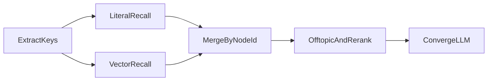

# 语义匹配第 2 阶段：向量召回开发计划

> 状态：已落地（引擎 `tagging-v4`）。
> 关联：[语义匹配与别名沉淀](语义匹配与别名沉淀.md)、[智能打标签统一改造](智能打标签统一改造.md)。

## 1. 目标与非目标

**目标**：补上字面/trigram 召回覆盖不了的「零汉字重叠」对齐，例如关键词「交集」对上节点「两个集合的公共元素」。向量命中一律视为 **fuzzy**，仍交给第 1 阶段收敛（`key` → 候选**完整原名**），LLM 不得发明节点。

**非目标**：

- 不把 embedding 塞进 `AiProvider`（该 trait 是解析/提取/收敛）。
- 不把 fuzzy / 向量命中自动写入 `tag_candidates`（审核队列只走教师「提交为新 / 等于已有」）。
- 不改编辑页 UI、不把 embedding 接到 OCR 解析 Prompt。
- 向量分数不得升 `exact` / `alias`。

别名闭环仍以第 1 阶段为主路径：教师「等于已有」→ 审核通过 → `aliases` → 下次 exact/alias 命中。

## 2. 分步实施

### 2.1 迁移（优雅跳过）

文件：`migrations/20260824000001_pgvector_embeddings.sql`

- `CREATE EXTENSION vector` 包在 `DO $$ … EXCEPTION $$` 中：无超管权限或服务器未安装扩展时 **NOTICE 后继续**，不让 sqlx migrate 失败。
- 仅当 `pg_extension.extname = 'vector'` 时建表：
  - `knowledge_node_embeddings(node_id PK → knowledge_nodes ON DELETE CASCADE, content_hash, embedding vector(1024), updated_at)`
  - `tag_embeddings(tag_id PK → tags ON DELETE CASCADE, …)`
- 可选 HNSW：`USING hnsw (embedding vector_cosine_ops)`；创建失败则跳过索引，小规模顺序扫描仍可用 `<=>`（余弦距离）。

运行时探测：`to_regclass('public.knowledge_node_embeddings')`；表不存在则整段向量召回短路。

### 2.2 Embedding 客户端

文件：`src/ai/embedding.rs`

- **不**实现 `AiProvider`。
- HTTP：`{QWEN_BASE_URL}/v1/embeddings`（已有 DashScope compatible-mode）。
- 模型：`text-embedding-v3`，`dimensions: 1024`。
- Key：`QWEN_API_KEY`；无 Key 则召回静默退回第 1 阶段。
- 批量每批最多 10 条；超时 30s。
- 查询向量进程内 `DashMap` 缓存（key 文本 → 向量），避免同一关键词反复打 API。
- **不占用** `ai_usage_log` 的 50 次/日录题额度（打标 extract/converge 已计费）；必要时只打 tracing。

嵌入文本：

| 对象 | 文本 |
|------|------|
| 知识节点 | `name_path + '\n' + name + '\n' + 别名顿号拼接` |
| 标签 | `category + '\n' + name + '\n' + 别名` |

`content_hash = sha256(model + dim + 文本)`；hash 未变则跳过重嵌。

### 2.3 索引维护

- 启动后 `tokio::spawn` 全量回填（不阻塞 listen）。
- 节点创建/改名/改别名、标签创建/更新、审核「加为已有别名」成功后异步 `upsert`。
- 复制默认树（注册）不逐节点打 API，交给启动回填。

### 2.4 召回并集

`recall_nodes`：字面 top-k ∪ 向量 top-k（每查询词向量 top-8）。

合并规则：

1. 同一 `node_id`：若任一侧为 exact/alias，保留确定性类型与其分数。
2. 两侧皆 fuzzy：取较高分，合并 `source_keys`。
3. **仅向量命中**：`match_type = fuzzy`，分数 `min(1 - cosine_distance, 0.80)`。

随后仍走 `filter_offtopic_candidates` / `rerank_by_topic` / 收敛。方法/素养 `match_tags`：字面未命中时再用向量 Top1，同样 cap 0.80 且 fuzzy。

### 2.5 开关与版本

| 变量 | 默认 | 含义 |
|------|------|------|
| `TAGGING_VECTOR_RECALL` | 开（`0` 关闭） | 生产开关 |
| `TAGGING_VECTOR_RECALL_TEST` | 关 | 仅 `cfg!(test)` 下强制开（避免集成测试误打 DashScope） |

`ENGINE_VERSION = tagging-v4`。异步打标任务哈希带上引擎版本，避免 v3 进行中任务被当成 v4 复用。

观测（不打题文）：`vector_recalled`、`vector_ms`；`TaggingEngine 完成` 日志里召回条数已含并集结果。

## 3. 文件清单

- `migrations/20260824000001_pgvector_embeddings.sql`
- `src/ai/embedding.rs`
- `src/ai/tagging/vector.rs`
- `src/ai/tagging/repository.rs`、`engine.rs`、`types.rs`、`mod.rs`
- `src/ai/mod.rs`、`src/config.rs`、`.env.example`、`src/main.rs`
- 钩子：`knowledge_nodes.rs`、`tags.rs`、`tag_governance.rs`
- `tests/ai_tagging_vector.rs`（无扩展则 skip）

## 4. 测试与验收

- 无 pgvector：迁移不失败；`recall_nodes` 行为与 v3 一致。
- 有扩展：纯函数测「exact 不被向量覆盖」「向量命中最高 0.80 且为 fuzzy」。
- 第 1 阶段回归：`cargo test --lib -- ai::tagging`、`tests/ai_tagging_engine.rs`。
- 手工：重启后端等回填结束后，用「交集」类零字面词打标，收敛菜单中应出现语义相近叶子。

## 5. 风险

| 风险 | 处理 |
|------|------|
| 无超管 / 未安装 vector | 迁移跳过，召回等同第 1 阶段 |
| 无 `QWEN_API_KEY` | 不请求 embedding |
| 向量把离题节点拉进菜单 | 已有离题过滤 + 收敛「离题禁选」；分数封顶 0.80 |
| 回填慢 / 配额 | 后台批处理；不计入录题日额度 |
| 索引滞后 | hash 跳过已新；写入后异步刷新 |
